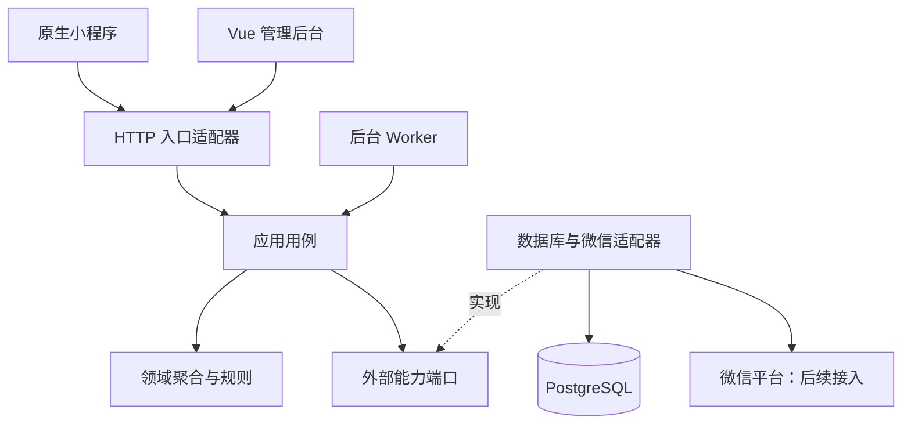
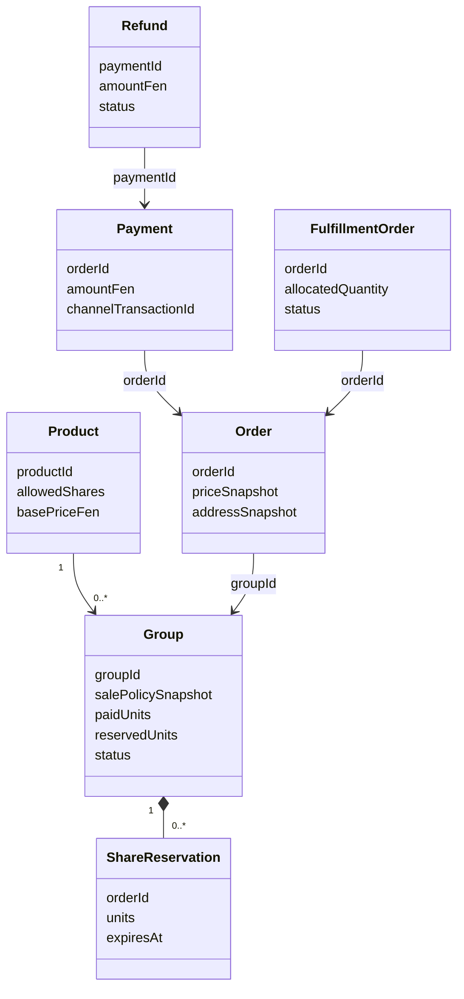

# 拼单平台架构设计

状态：T001 框架、T002 商品/图片、T003 用户身份、T004 拼单匹配/份额预占/订单报价、T006 微信支付/退款/交易闭环已落地；履约/客服仍待实施。日期：2026-10-01。

## 范围与选型

第一期面向预计不超过 1000 名用户，采用单仓库、独立前端、模块化后端单体。用户数不是峰值并发承诺；本轮不实现扩容、分布式锁、集群或压测，但交易任务必须实现数据库事务、容量约束和幂等（T002 已为库存调整落地行锁事务、幂等键与 CHECK 约束）。

| 部分 | 选型与用途 |
| --- | --- |
| 小程序 | 原生 WXML/WXSS/TypeScript，开发者工具编译与预览；T002 提供真实商品列表/详情 |
| 管理后台 | Vue 3、TypeScript、Vite；T002 提供登录、商品、库存、图片库页面 |
| 后端 | NestJS + TypeScript；领域与应用逻辑保持框架无关 |
| 数据库 | PostgreSQL 17 系列；迁移经 `backend/migrations` + advisory lock 执行 |
| 图片存储 | 本地文件适配器 + Docker 命名卷 `media-data`；`ImageStorage` 端口保留对象存储接入边界 |
| 后台进程 | 同一后端工程的 Worker；单循环五任务（预占过期、组截止、支付查询补偿、退款驱动、异常统计），全 DB 驱动、重启自动恢复（T006 D010） |
| 契约 | 独立 TypeScript 传输类型 + OpenAPI；不共享后端实体 |
| Docker | API（启动前自动迁移）、Worker、后台静态服务、PostgreSQL；Redis 为可选 profile |
| 文件与实时通信 | 对象存储与标准 WebSocket 保留接入边界，业务任务再接入 |

依赖精确版本与 lockfile 在根目录管理。Docker 镜像使用明确主版本系列；镜像 digest 可在发布时固定。第一期只有一个 API 实例，数据库是持久化事实来源。

## 总体结构

后端的 `src/contexts/` 按限界上下文划分，每个上下文内部再分 `domain/`、`application/`、`adapters/inbound/` 和 `adapters/outbound/`。`src/bootstrap/` 只做 NestJS 装配；`src/workflows/` 协调跨领域流程。目录存在不代表业务已实现。

## 领域与候选实体

| 上下文 | 聚合与模型 | 拥有的事实 |
| --- | --- | --- |
| catalog | Product、ProductSpec、SalePolicySnapshot、MediaAsset（T002 已实现商品/图片） | 当前商品配置、图片资源及销售规则 |
| inventory | Stock、StockReservation、StockMovement（T002 已实现整件库存与留痕；预留字段保留未启用） | 整件库存调整；预留属后续交易任务 |
| group-buying | Group、ShareReservation、ShareUnits（T004 已实现：容量 60 单位制、可完成性 DP、组匹配、预占） | 组容量、预占、生效及组状态 |
| ordering | Order、Quote、PriceSnapshot、AddressSnapshot（T004） | 用户交易与不可变订单快照；支付事实归 Payments |
| payments | Payment、Refund、Money | 实付、实退和渠道结果 |
| fulfillment | FulfillmentOrder、Shipment、Quantity | 独立数量分配和发货事实 |
| identity-access | User、Admin、Role、Address（T002 后台管理员；T003 用户/微信身份/用户会话/收货地址） | 后台与用户身份、会话、地址簿 |
| customer-service | Conversation、Message、AgentProfile | 会话、留言与消息记录 |
| after-sales | Ticket、TicketAction | 售后处理记录 |
| notifications / audit / reporting | Notification、OperationLog（T002 已实现基础操作日志）、查询投影 | 投递、审计和统计；不改写交易事实 |

实体之间跨聚合使用 ID 或不可变快照关联，不把需求名词直接映射为数据库表。

此图为业务候选关系，不表示同一聚合、外键或本轮已实现的模型。

## 六边形依赖方向

- domain 不导入 NestJS、pg、微信 SDK 或其他上下文实现。
- application 使用自身端口和领域模型；通过公开契约协作，不访问他域仓储。
- adapters 实现端口并转换 HTTP DTO、数据库结果和领域对象。
- bootstrap 使用依赖注入 token 绑定具体适配器；应用对象可直接用于测试。
- workflows 是应用层的跨领域协调者，不承载金额和份额核心算法。
- 数据库事务边界由应用协调声明，数据库适配器执行。外部 HTTP 调用不放在持锁的数据库事务中。
- 架构检查脚本检查已存在的领域/应用代码是否反向依赖框架或适配器；后续业务增加时持续运行。

## 前端与契约

小程序主入口为商品、订单、我的，页面及其组件按 feature 目录存放；业务页面尚未实现时明确显示占位提示。管理后台包含商品库存、拼单订单、财务、履约、客服、售后和看板导航，未实现页面不得伪造可操作的订单或支付数据。

T002 起接入鉴权与业务接口：守卫按认证域分派（admin 默认拒绝 + 权限码；T003 新增 user 域小程序会话），会话为 DB 会话（token 仅登录响应返回一次，库存 sha256 哈希），两类 token 不可互用。微信登录经 `WxAuthPort`/`WxPhonePort` 服务端调用 code2Session 与手机号组件（未配置凭据时显式失败）。图片公开读取仅限商品图片场景，客服图片后续单独定义访问控制。

- `/api/health/live`：进程存活，不包含数据库详情。
- `/api/health/ready`：实际查询 PostgreSQL，失败返回 503；不泄露连接串。
- `/api/mini/v1/platform`、`/api/admin/v1/platform`：公开框架元数据，已实现上下文标为 partial。
- `/api/health/openapi`：接口文档（contracts/openapi.yaml，含 T002 全部接口契约）。
- `/api/admin/v1/auth|media|products|…`：后台接口，Bearer 认证 + 权限码。
- `/api/mini/v1/products`：公开商品接口（仅上架商品）。
- `/api/mini/v1/auth|addresses`：小程序用户登录、资料、手机号与地址接口（user 域 Bearer）。
- `/api/admin/v1/users`：后台用户管理（user:manage 权限；脱敏 + 敏感查看审计）。
- `/api/mini/v1/orders`：小程序下单（幂等键）/列表/详情/取消（user 域 Bearer）。
- `/api/admin/v1/orders|groups`：后台订单与拼单组查询（order:manage；仅 GET）。
- T006 支付闭环：微信支付 v3 适配器（请求签名/paySign/下单/查单/关单/退款）、回调验签解密+幂等应用、五态退款（out_refund_no 幂等、失败落异常队列、人工重试审计）、迟到支付全额自动退款（D008）。未配置商户参数时全部渠道方法显式报错，无模拟成功路径。
- `/api/media/v1/assets/{id}`：公开图片读取（仅 ready 资源，长缓存）。
- 后续微信回调与客服 WebSocket 接口另行设计，当前不提供假回调或假聊天接口。

API 统一包含 requestId；错误响应包含 code、message、requestId（及原因 details）。客户端不能将本地支付提示当作后端支付事实。金额以整数分表达；数量为十进制字符串（≤3 位小数）。管理员登录限流为进程内实现（单实例边界），多实例部署时需替换为共享存储。已落地的强一致边界：登录事务（用户+微信身份+会话）、默认地址切换（users 行锁 + 部分唯一索引）、下单事务（组行锁重查容量与可完成性 + 尾差判定 + 预占/订单原子提交）、建组整件预留（条件更新 available>0 + business_key 幂等）、并发最后份额恰一人成功、支付确认事务（组行锁内预占转换+组金额+订单 paid+组满消耗原子提交；channel_transaction_id 唯一约束保证重复回调幂等；渠道 HTTP 调用在事务外）、取消已支付（同事务：退款单+订单 cancelled+组 paid 容量即扣，D007）。

## 交易设计保留项

下单时组匹配、份额预占、必要的整件库存预留和订单创建应保持原子性。支付确认后将预占转为生效，不重复占容量。支付、退款、履约分别记录状态，展示层组合为用户订单状态。

跨系统事件计划使用 Outbox 与消费去重；本轮仅建立 Worker 入口，不实现 Outbox、退款或到期调度。服务重启后的任务恢复要在业务任务中验证。

以下决策仍未确定：尾差报价与取消重组、成功后的取消资格、库存释放时点、配置变更与既有组关系、迟到支付判定及商品数量精度。本轮不通过伪实现默认解决这些问题。

## Docker 与运行边界

Docker Compose 提供本地开发/联调环境：数据库端口默认仅绑定本机，API 3000，后台 8080。数据库与图片分别使用命名卷 `postgres-data`、`media-data` 持久化，普通停止不得删除卷。API 容器启动前自动执行迁移（advisory lock 防并发）；初始管理员经 `create-admin` 脚本以环境变量凭据创建，凭据不进入源码、镜像和日志。管理后台由 Nginx 反向代理 `/api/` 到 API，避免浏览器依赖容器服务名；图片访问地址由 `PUBLIC_API_BASE_URL` 生成绝对 URL，后台与小程序均可访问。

小程序运行在微信开发者工具或真机，Docker 不替代微信运行环境。开发者工具可连接本地 API；真机与正式环境需要可访问的 HTTPS 服务及微信平台配置。

Worker 通过依赖检查更新健康文件，失败不保持健康状态。它不执行业务任务，管理页面和说明必须明确这一点。Redis profile 只准备环境，本轮代码不依赖 Redis。

正式部署的域名、TLS、微信 AppID、支付商户配置、对象存储和业务权限是后续任务；当前环境不能视为正式上线的交易平台。

## 开发任务顺序

T001 框架与 Docker → T002 身份/商品/库存 → T003 拼单交易闭环 → T004 履约 → T005 客服售后 → T006 运营看板。权限和审计随业务接入。所有大任务均先 DDD/spec/plan、前端与契约准备，再子功能实施，专项通过后全量测试。

选型依据：
- https://github.com/wechat-miniprogram/api-typings
- https://vuejs.org/guide/typescript/overview.html
- https://docs.nestjs.com/modules
- https://www.postgresql.org/docs/current/explicit-locking.html
