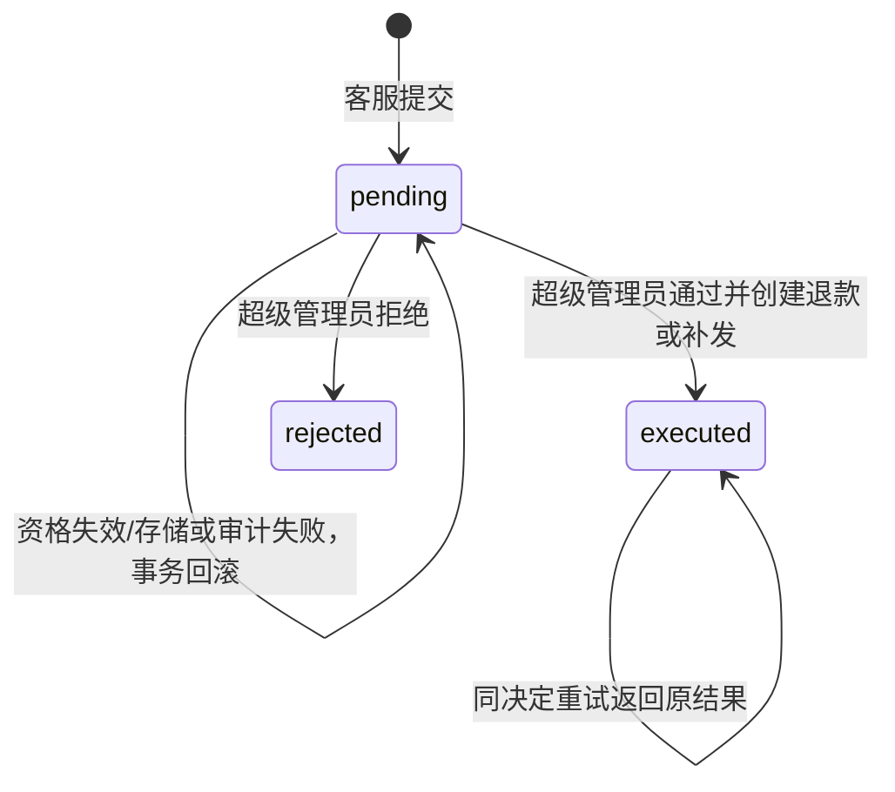
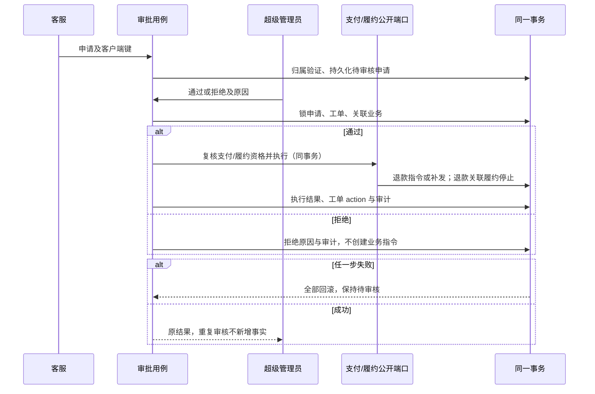

# 审批领域模型

认领见 README。新增 ActionRequest 聚合，保存工单/订单/申请人 ID、类型 refund/reshipment、不可变请求内容、客户端键、审核人/原因/结果引用。状态 pending→executed/rejected，executed指公开业务指令已经创建，不表示退款到账。申请复用 Ticket 归属和处理状态，金额、包裹仍归 Payments/Fulfillment。

每次申请锁工单，唯一键为申请人+客户端键；审核锁申请及工单，再按组、履约单顺序与公开端口协调。跨聚合使用同一 PostgreSQL 事务，因为审批、资金指令、履约停止与工单审计必须原子。退款数量与金额快照不可重算；普通客服不能提供超级管理员授权标志（从服务端登录 principal 推导）。

履约停止记录归 Fulfillment，以订单/退款引用为值，不拥有支付状态。生成按原全部已支付份额分配，再跳过已停止订单，其他用户分配不因售后退款改变；按组锁与批准退款协调。已有履约单在同一行锁内与发货竞争：先发生的包裹保留，停止生效后禁止新增。补发复用公开 ShipFulfillmentUseCase 并贯穿审批事务。

