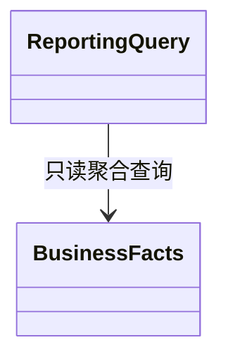

# F037-dashboard-reporting 复用模型索引

主领域Reporting，协作IdentityAccess与相关业务只读事实；完整术语/聚合/值对象/状态/事务/UML复用[T009 DDD](../../tasks/T009-dashboard-notification-audit/ddd.md)。只读运营投影；时间按上海日界，退款申请/受理/到账分列，金额整数分；单查询快照，不修改交易。

这是独立复验发现的子目录模型索引缺失补齐，不声称当时已有本文件；不新增领域行为。Codex负责本轮文档复核；原实现与授权范围不变。

