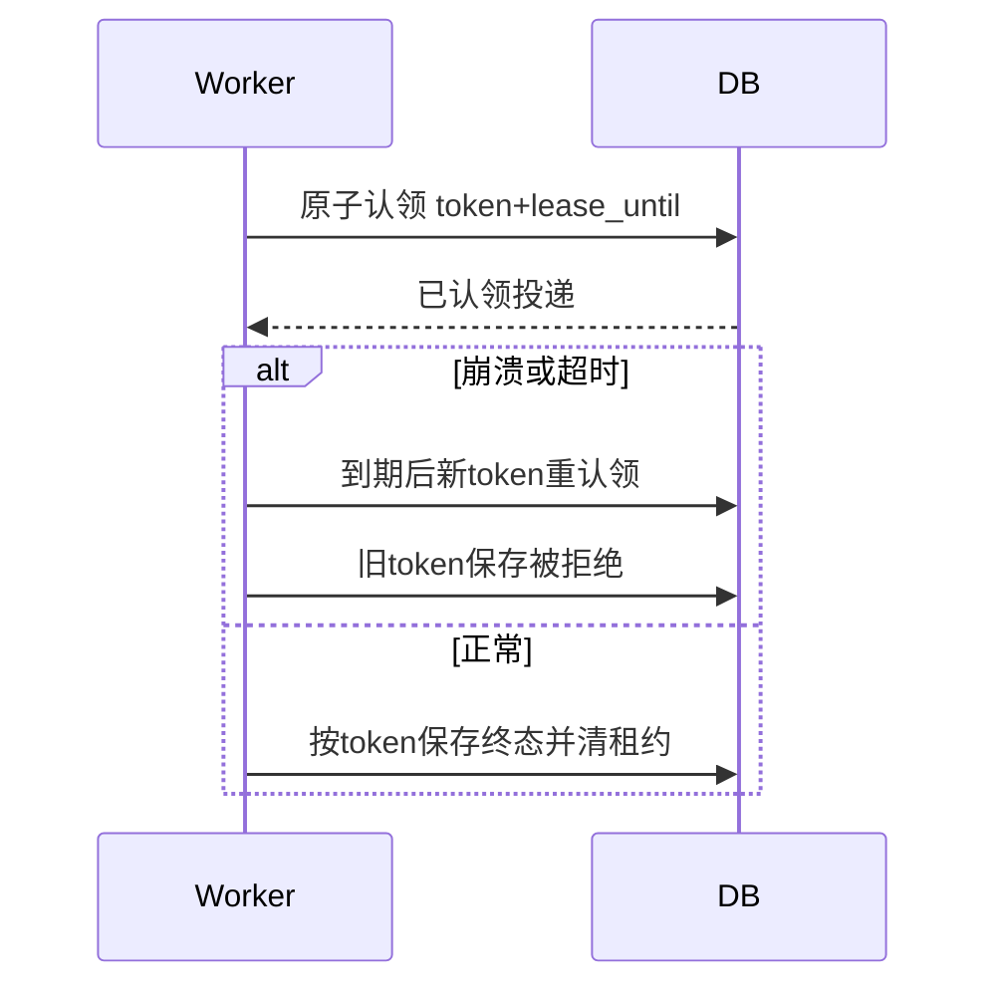

# F038 通知投递 DDD 与独立审查修订

复用 [T009 DDD](../../tasks/T009-dashboard-notification-audit/ddd.md) 的 Notification 聚合、Delivery 实体、幂等键与状态机，不新增业务聚合。

2026-10-02 独立审查：通知及所有初始投递为同一事务；租约用独立 lease_token/lease_until，与业务退避时间分离。认领使用单条条件更新和 SKIP LOCKED；结果保存校验认领令牌，过期后重新认领的旧进程不能覆盖新结果。手工重试与审计共享事务，租约有效时不允许重置。外部发送在事务外，网络发送本身不能承诺 exactly-once；本轮渠道为 skipped，后续真实外发需渠道幂等策略。

超时提醒按当前主管接收者筛选缺通知的会话后分页，已提醒会话不占用批次容量；主管变化时新接收者仍可补建。不变更 D022 的提醒对象或分配规则。

