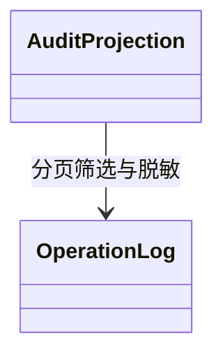

# F039-audit-access-query 复用模型索引

主领域Audit / IdentityAccess，协作IdentityAccess与相关业务只读事实；完整术语/聚合/值对象/状态/事务/UML复用[T009 DDD](../../tasks/T009-dashboard-notification-audit/ddd.md)。复用OperationLog不可变事实和Role权限值对象；入口认证、应用授权、响应脱敏；资金审核权限仍由D020控制。

这是独立复验发现的子目录模型索引缺失补齐，不声称当时已有本文件；不新增领域行为。Codex负责本轮文档复核；原实现与授权范围不变。

