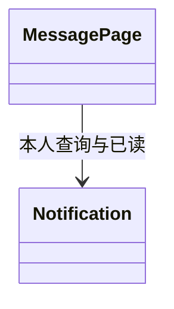

# F040-mini-message-integration 复用模型索引

主领域两端展示 / Notifications，协作IdentityAccess与相关业务只读事实；完整术语/聚合/值对象/状态/事务/UML复用[T009 DDD](../../tasks/T009-dashboard-notification-audit/ddd.md)。复用Notification已读幂等模型，无新聚合；本人权限、保持首次已读时间、界面并发去重，不以UI决定投递或退款事实。

这是独立复验发现的子目录模型索引缺失补齐，不声称当时已有本文件；不新增领域行为。Codex负责本轮文档复核；原实现与授权范围不变。

