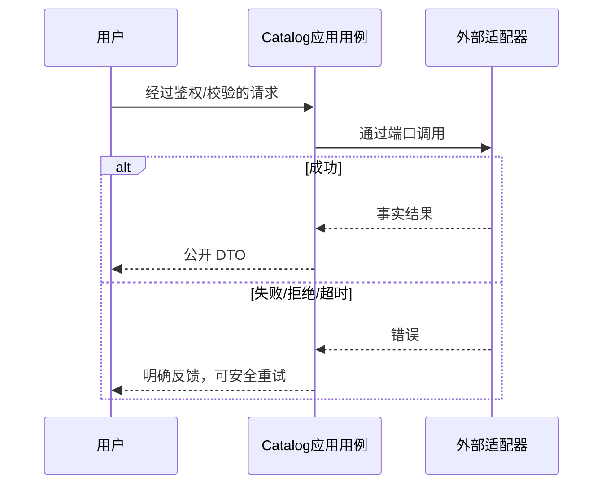

# 商品搜索分类与演示素材领域设计

商品展示分类 fruit/snack/drink/other；只搜索上架名称，字面量关键字≤60，过滤后分页。旧商品默认 other；分类不进入交易快照。媒体、Product 与库存创建复用现有用例。

分类与 Product 同事务保存，迁移0029新增默认字段，不改变价格和既有组。导入仅 local 环境，素材清单固定指纹，管理员接口上传/创建/上架，失败可重跑不覆盖旧商品。

领域不变量、事务及失败路径复用 [T013 DDD](../../tasks/T013-mini-experience-refresh/ddd.md)。

