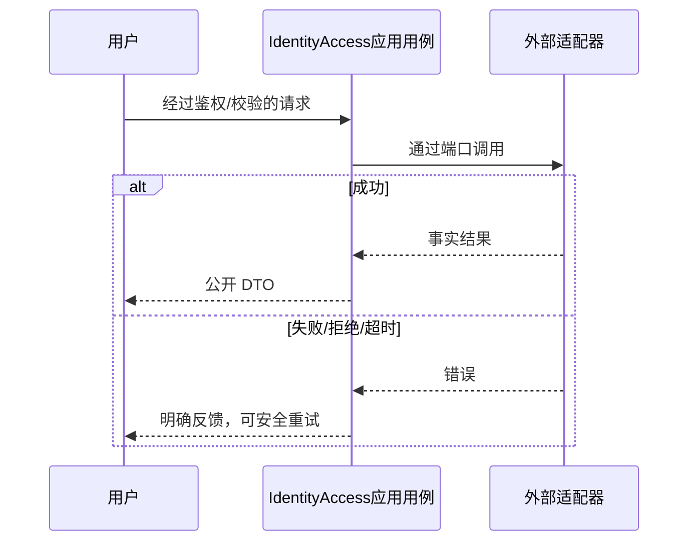

# 地址原生选点领域设计

复用收货地址模型，无新增聚合。选点数据是临时表单辅助；保存时不带坐标、不改订单或履约地址快照。

调用 wx.chooseLocation，需微信位置/隐私权限；不使用第三方地理编码，暂不需要地图 Key。不猜测行政区划，选择后清空待确认省市区，保留手填。

领域不变量、事务及失败路径复用 [T013 DDD](../../tasks/T013-mini-experience-refresh/ddd.md)。

