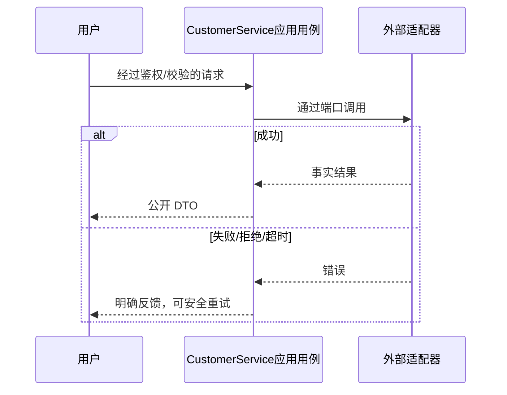

# Pi 智能客服领域设计

智能会话按 userId 归属，AiTurn 记录文本、回复、状态、clientMessageId、租约。应用用例仅能读写本人智能轮次；Pi 出站适配空 tools；无业务写工具。

迁移0030增加独立轮次表及唯一键/用户索引；认领与完成短事务，模型 HTTP 不持有事务。默认30秒模型超时、租约45秒、每分钟10次、最近20条/8000字符，失败可同键重试；新 Agent 每次请求重建本人上下文。GET before ISO/pageSize20最多50；POST UUID/text≤1000，401/400/409/429/502/503/504准确；空模型配置保留人工客服正常。

领域不变量、事务及失败路径复用 [T013 DDD](../../tasks/T013-mini-experience-refresh/ddd.md)。

