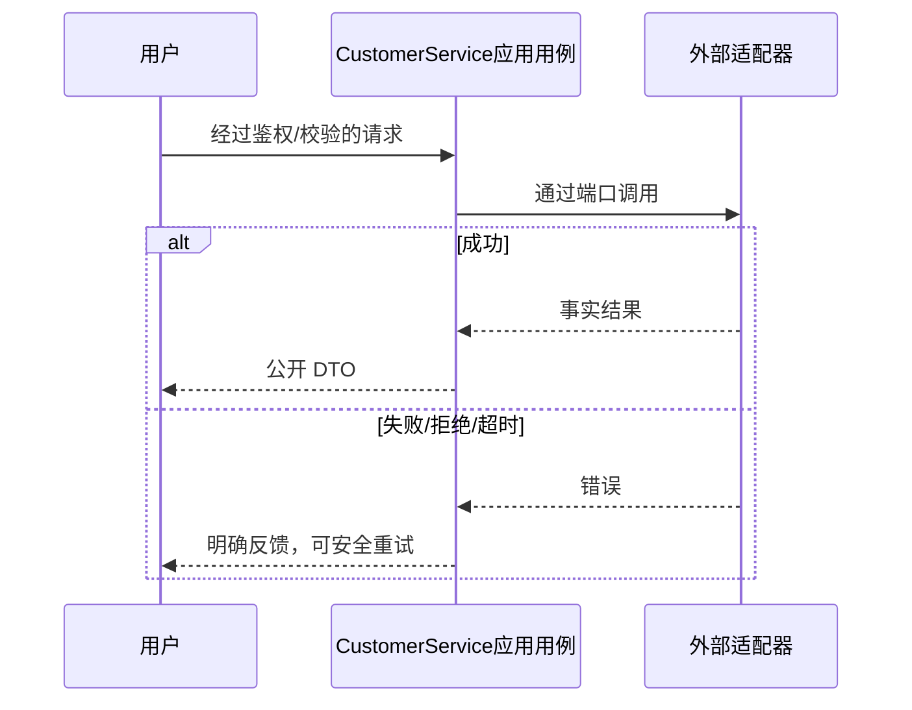

# Pi 智能客服领域设计

## T015模型修订（实现前）

空tools为T013历史边界；本轮明确授权后按[F053 DDD](../F053-ai-catalog-guidance/ddd.md)仅增加AiCatalogPort/只读工具和AiTurn推荐快照/意图，不拥有商品或交易写权限。完成UPDATE同lease原子保存文本与元数据，失败清空。

## T014 Tab修订（实现前）

复用[T014 DDD/UML](../../tasks/T014-support-companion/ddd.md)。页面由导航栈改为缓存Tab；onShow身份确认及本页请求版本控制归属前端应用状态，不改变AiTurn、数据库或模型适配器。发送/载入/分页迟到结果必须以同身份及当前版本为前提，不能跨用户写页面；隐藏时精灵静止。

智能会话按 userId 归属，AiTurn 记录文本、回复、状态、clientMessageId、租约。应用用例仅能读写本人智能轮次；Pi 出站适配空 tools；无业务写工具。

迁移0030增加独立轮次表及唯一键/用户索引；认领与完成短事务，模型 HTTP 不持有事务。默认30秒模型超时、租约45秒、每分钟10次、最近20条/8000字符，失败可同键重试；新 Agent 每次请求重建本人上下文。GET before ISO/pageSize20最多50；POST UUID/text≤1000，401/400/409/429/502/503/504准确；空模型配置保留人工客服正常。

领域不变量、事务及失败路径复用 [T013 DDD](../../tasks/T013-mini-experience-refresh/ddd.md)。

