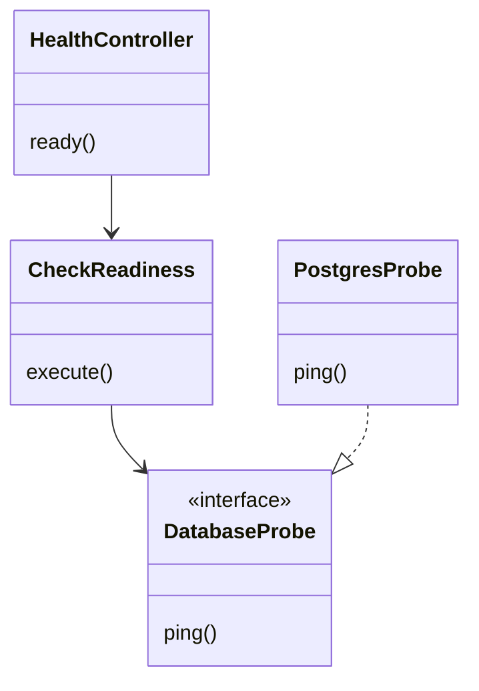
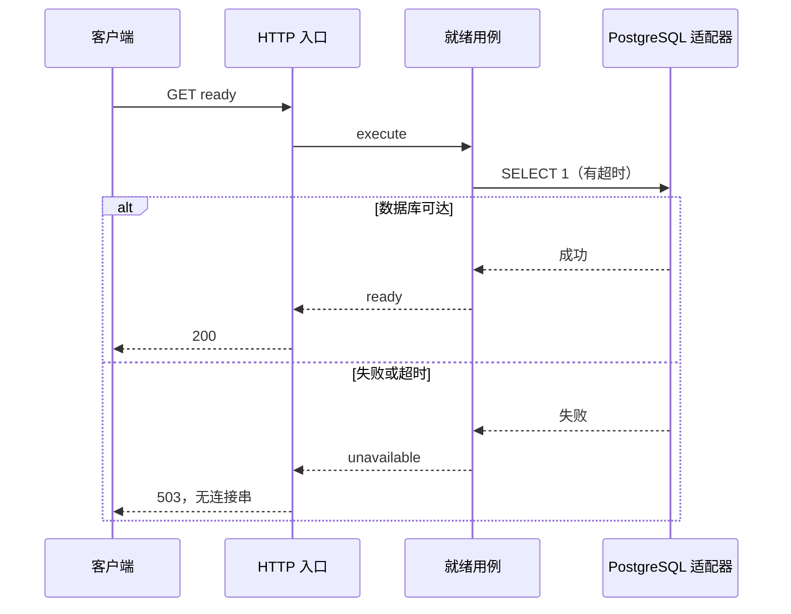

# T001 领域分析

平台工程仅提供装配和运行能力，不拥有商品、份额、订单或资金事实。领域认领与候选实体复用 [整体架构](../../architecture.md)；本轮不新增业务聚合，不创建“健康检查实体”或将模块目录当作已完成领域。

统一语言：存活表示进程可响应；就绪表示数据库依赖当前可访问；已规划表示只有边界；已实现表示有满足独立 spec 的业务用例。前端 mock 是交互占位，不能生成支付事实。

端口：DatabaseProbe（依赖就绪检查）。应用用例：读取平台元数据、检查就绪。适配器：pg 查询、HTTP、Worker 健康记录。当前检查时间由适配器获取；未来涉及业务时间规则时再引入 Clock 端口。业务模块留出纯领域、应用端口和入/出站适配器目录。

不变量：数据库不可达时 ready 不得返回成功；live 不依赖数据库；接口不得暴露凭据；未实施的领域显示 planned；后台 API 路径在本机及 Docker 代理下保持一致。

没有交易写入或跨聚合事务；支付、并发容量、退款补偿模型留待对应功能。本轮测试策略不采用 TDD：框架装配和页面展示为主，完成实现后做应用用例、HTTP 故障路径、架构边界及 Docker 冒烟验证。
