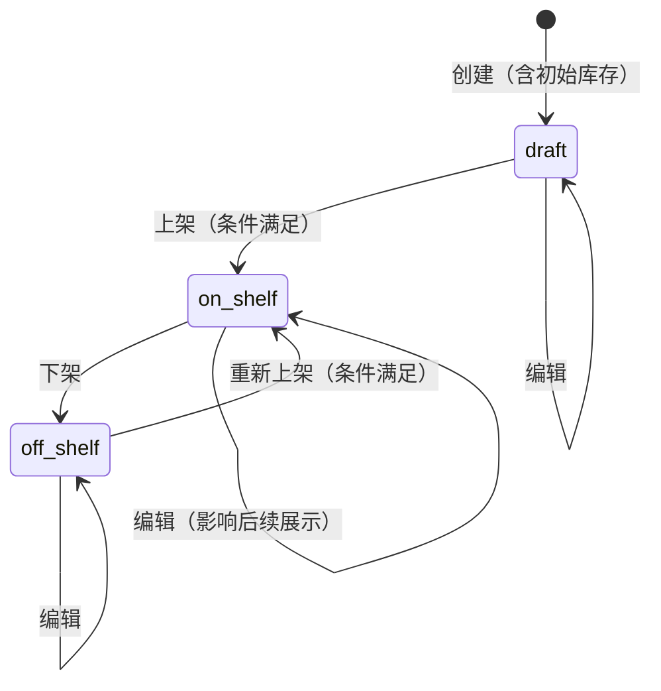
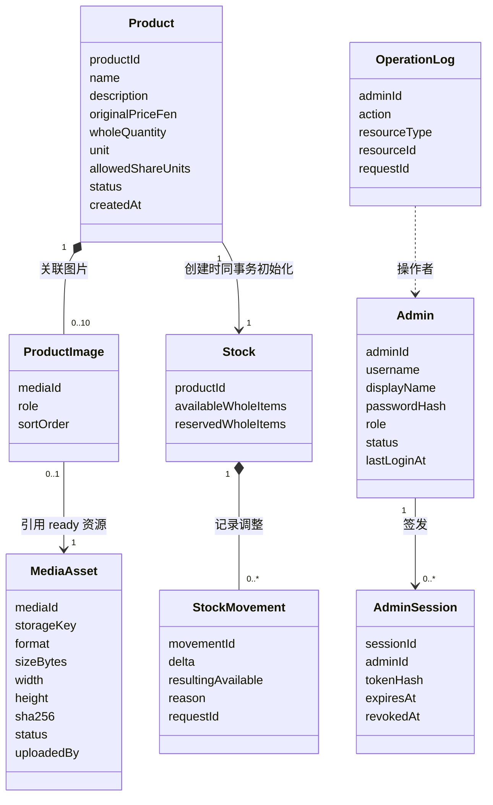
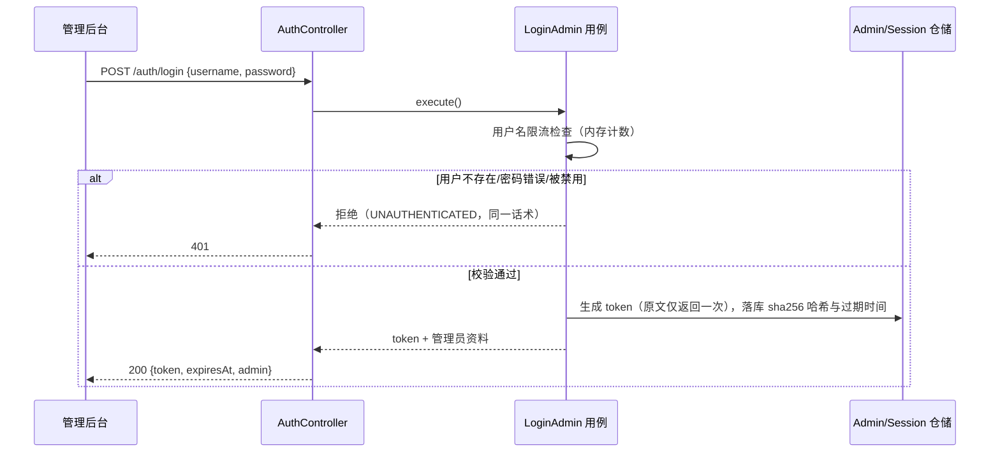
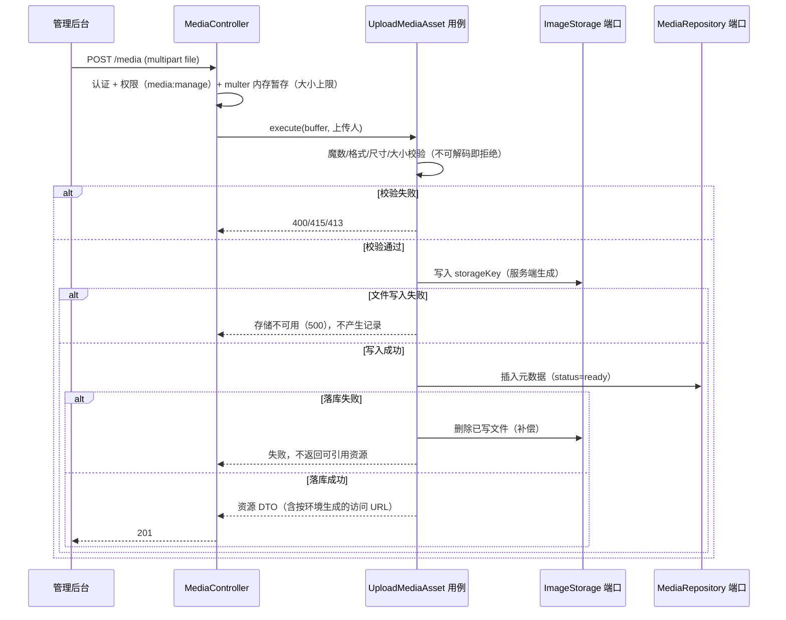
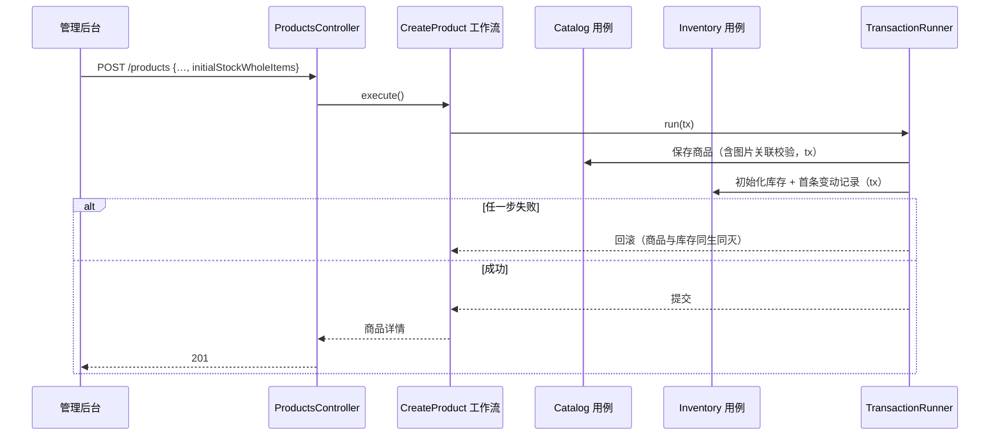
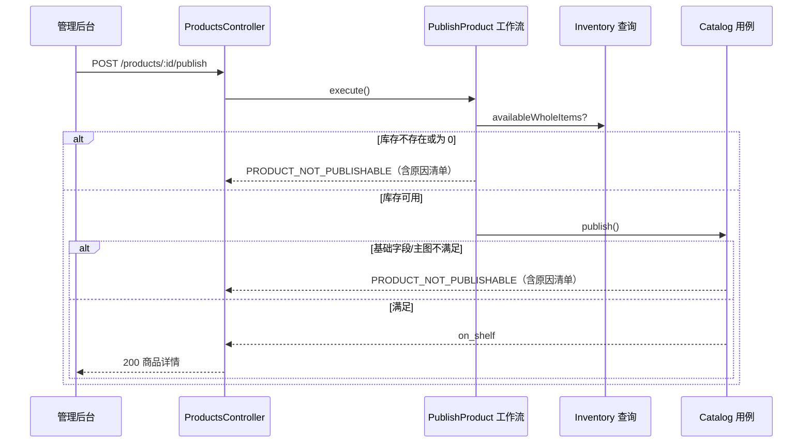

# T002 领域驱动设计

关联：[T002 spec](spec.md)、[整体架构](../../architecture.md)、[AGENTS 领域划分](../../../AGENTS.md)。本任务在既有限界上下文内落第一个真实业务闭环，不新增上下文、不修改上下文边界。

## 1. 领域认领与统一语言

| 术语 | 英文 | 含义与归属 |
| --- | --- | --- |
| 管理员 | Admin | IdentityAccess 聚合根；后台操作者，当前仅 `super_admin` 角色 |
| 管理员会话 | AdminSession | IdentityAccess 实体；登录后签发的服务端会话，DB 保存哈希 |
| 权限 | Permission | IdentityAccess 值对象；如 `catalog:manage`，由角色推导 |
| 图片资源 | MediaAsset | Catalog 聚合根（媒体资产）；一次上传产生的不可变图片文件与元数据 |
| 存储标识 | StorageKey | 值对象；服务端生成的存储路径，不含宿主绝对路径 |
| 商品图片 | ProductImage | Catalog 实体（属于 Product）；商品与图片资源的关联，含用途与排序 |
| 商品 | Product | Catalog 聚合根；名称、描述、原价、整件数量、计量单位、允许份额、状态 |
| 份额选项 | ShareOption | Catalog 值对象；`1/2..1/5`，以 60 单位制表达（30/20/15/12） |
| 参考份额价 | ReferenceSharePrice | Catalog 领域服务输出；仅用于展示，不是支付报价 |
| 整件库存 | Stock | Inventory 聚合根；商品当前可售整件数（预留字段为本任务后扩展保留） |
| 库存变动 | StockMovement | Inventory 实体；一次管理员调整的不可变记录 |
| 操作日志 | OperationLog | Audit 实体；后台写操作与登录的追加型记录 |

份额规则沿用已确认规则：整件 = 60 单位；有效选项仅 1/2=30、1/3=20、1/4=15、1/5=12；仅允许商品配置的选项。用户端整件参考售价 = 原价 + 500 分固定服务费。

## 2. 聚合与不变量

### 2.1 Admin（IdentityAccess）

- 属性：`adminId`、`username`（唯一，小写存储）、`displayName`、`passwordHash`（scrypt）、`role`、`status`、`lastLoginAt`。
- 不变量：用户名唯一且仅小写字母/数字/`-`/`_`（3–32 位）；密码哈希不离开 IdentityAccess；`disabled` 状态拒绝登录与会话续用。
- AdminSession：`sessionId`、`adminId`、`tokenHash`（sha256，原文不落库）、`expiresAt`、`revokedAt`。不变量：过期或已撤销的会话不能通过认证；同一管理员可有多条并发会话。

### 2.2 MediaAsset（Catalog，独立聚合）

- 属性：`mediaId`、`storageKey`、`format`（jpeg/png/webp）、`sizeBytes`、`width`、`height`、`sha256`、`status`（ready/deleted）、`uploadedBy`、`createdAt`。
- 不变量：
  - 资源一旦 ready 不可变（不更新图片内容，重传即新资源）；
  - `storageKey` 由服务端按 `products/{yyyy}/{uuid}.{ext}` 生成，客户端不能指定路径；
  - 只有 `ready` 资源可被商品引用和公开访问；
  - 上传校验通过（魔数与头部解析一致、大小、尺寸界限）才允许进入存储与落库；落库失败必须删除已写文件（补偿）。
- 与 ProductImage 分开建模：资源是可复用文件事实，商品图片是商品聚合内的关联事实（用途 main/detail + sortOrder）。删除资源前必须无任何商品引用。

### 2.3 Product（Catalog 聚合根）

- 属性：`productId`、`name`、`description`、`originalPriceFen`（整件原价，分）、`wholeQuantity`（整件数量，最多 3 位小数的十进制字符串）、`unit`（计量单位）、`allowedShareUnits`（30/20/15/12 的非空子集）、`status`（draft/on_shelf/off_shelf）、`images`（0..1 张 main + 0..9 张 detail）、`createdAt/updatedAt`。
- 不变量：
  - `originalPriceFen` 为正整数；`wholeQuantity` > 0 且 ≤ 3 位小数；`unit` 非空（≤ 10 字符）；名称非空（≤ 60 字符）；
  - 份额选项必须是四个合法值之一且非空去重；
  - main 图片至多一张且必须为 ready 资源；同一资源在同一商品内至多关联一次；
  - 上架条件（全部满足才允许 `draft|off_shelf → on_shelf`）：基础字段完整合法、已设置 main 图片、库存记录存在且 `availableWholeItems > 0`；
  - 已上架商品允许编辑（当前无订单，不存在改写历史交易的问题；未来引入订单快照后此规则需重新决策，见 spec 待决策）。
- 状态机：

无终止状态；本任务不提供商品删除。需求文档中的“待上架/已售罄/已结束”是展示投影：`待上架` 由“草稿且满足上架条件”推导，`已售罄` 由“上架且库存为 0”推导，不作为存储状态。

### 2.4 Stock（Inventory 聚合根）

- 属性：`productId`（主键，1:1 对应商品）、`availableWholeItems`、`reservedWholeItems`（本任务恒为 0，字段为未来整件预留保留，不宣称已实现预留）、`updatedAt`。
- StockMovement：`movementId`、`productId`、`delta`（本次变化，非 0）、`resultingAvailable`、`reason`、`actorAdminId`、`requestId`（可选幂等键）、`createdAt`。
- 不变量：
  - `availableWholeItems ≥ 0` 且 `reservedWholeItems ≥ 0`（数据库 CHECK 兜底 + 应用内行锁事务保证并发不透支）；
  - 调整后余额不可为负，否则拒绝（409）；
  - 每次成功调整必须留下一条变动记录；`setTo` 绝对值调整幂等（同值重复调用不产生新变动），`delta` 调整非幂等但支持可选 `requestId` 去重（同 `product+requestId` 重复请求返回当前状态，不重复记账）；
  - 库存为 0 不自动下架，由展示层推导“已售罄”。

### 2.5 OperationLog（Audit）

- 属性：`logId`、`adminId`、`action`、`resourceType`、`resourceId`、`detail`（jsonb）、`requestId`、`createdAt`。
- 不变量：追加型，不允许修改删除；由入口适配器在用例成功后写入，不参与业务决策、不影响主流程成功与否（写日志失败仅记录服务端错误）。

## 3. 值对象与领域服务

- `ShareOption`：`units ∈ {30,20,15,12}`，提供展示标签（1/2 等）与对应比例。
- `ReferencePricing`（领域服务，纯函数）：`userWholePriceFen = originalPriceFen + 500`；`referenceSharePriceFen = halfUp((originalPriceFen + 500) × units / 60)`，整数分运算 `floor((p×u + 30)/60)`。仅用于展示；正式尾差分摊与支付报价属后续交易任务。
- `ShareQuantity`（领域服务）：`shareMilli = floor((totalMilli × units + 30)/60)`，保留 3 位小数展示（如 10 斤的 1/3 = 3.333 斤）。这是展示舍入，未来履约拆分的数量精度规则尚未确认，不由本规则代替。
- `Quantity`：十进制字符串值对象，校验 `>0`、≤3 位小数、≤ 999,999,999。
- `Money`：整数分；所有金额传输与存储均为整数，禁用浮点。

## 4. 跨上下文关系与事务边界

- Catalog ↔ Inventory：商品创建（含初始库存）跨两个上下文，由 `workflows/create-product` 协调，同一数据库事务内提交（`TransactionRunner` 端口 + pg 适配器实现）；上架校验需要读取库存可用性，由 `workflows/publish-product` 先查询 Inventory 再调用 Catalog 上架，两步不锁同一事务（当前无并发交易，竞争窗口与后果见 spec）。
- Catalog ↔ IdentityAccess：上传人、库存调整人通过 `adminId` 关联；商品/图片/库存写接口在入口适配器做会话认证与权限校验。
- 任意上下文 → Audit：操作日志经 Audit 公开用例写入，入口适配器调用；业务用例不依赖日志结果。
- 强一致边界：单个聚合内修改 + create-product 事务 = 强一致；publish 的“库存检查 → 状态变更”为先后两步（非原子），上架后库存立刻被调成 0 是允许的业务序列（展示为已售罄），不产生数据不一致。

## 5. UML 类图（本任务实现范围）

## 6. 关键时序

### 6.1 管理员登录（失败与限流路径）

### 6.2 图片上传（校验、补偿与失败路径）

### 6.3 创建商品（跨上下文事务）

### 6.4 上架（条件校验与失败路径）

## 7. 存储与端口设计（适配器关注点，领域不依赖）

- PostgreSQL 表：`admins`、`admin_sessions`、`admin_operation_logs`、`media_assets`、`products`、`product_images`、`stocks`、`stock_movements`；迁移见 `backend/migrations/0001..0005`。
- 出站端口：`AdminRepository`、`SessionRepository`、`PasswordHasher`（scrypt 适配器）、`TokenGenerator`（crypto 适配器）、`ProductRepository`、`MediaRepository`、`ImageStorage`（本地文件适配器，Docker 命名卷；保留对象存储接入边界）、`StockRepository`、`OperationLogRepository`、`TransactionRunner`、`Clock`。
- 访问 URL：`media_assets` 只存 `storageKey`；响应时按 `PUBLIC_API_BASE_URL` 生成 `GET /api/media/v1/assets/{id}` 绝对地址（未配置时回退 `http://127.0.0.1:3000`），小程序与后台都可访问；不落库绝对路径或签名 URL。
- 唯一约束兜底：`admins.username` 唯一、`admin_sessions.token_hash` 唯一、`media_assets.storage_key` 唯一、每商品至多一张 main（部分唯一索引）、`(product_id, media_asset_id)` 唯一、`(product_id, request_id)` 部分唯一（库存幂等）、库存与变动结果 CHECK ≥ 0。

## 8. 复用与新增理由

- 复用 T001：NestJS 装配方式、requestId 中间件、错误过滤器骨架、pg 连接模式、架构检查、测试组织（tests/task-suites）。
- 新增：迁移执行器与 schema_migrations（T001 无业务表）、共享内核 `ApplicationError`/`TransactionRunner`/`Clock`（首个跨上下文事务所需，保持最小）、multer（multipart 解析）、image-size（纯 JS 图片头部解析，无原生依赖）。
- 不引入：ORM（保持 pg + SQL 与六边形边界）、对象存储 SDK（仅留端口）、JWT（选择 DB 会话，可撤销、单实例足够）、vue-router（沿用现有 hash 路由方式）。
