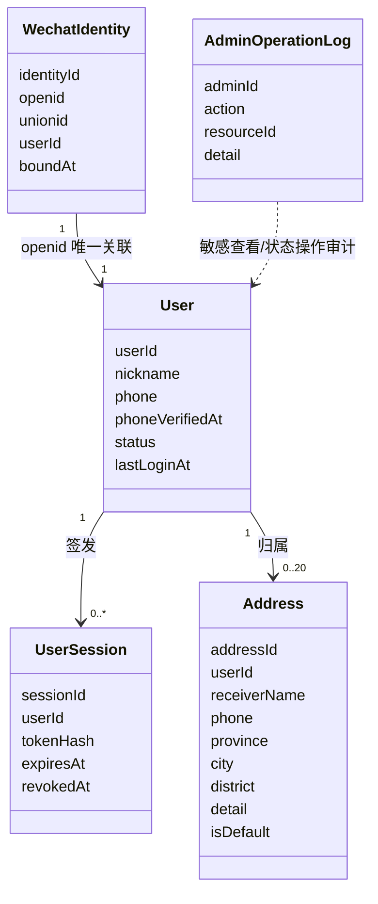
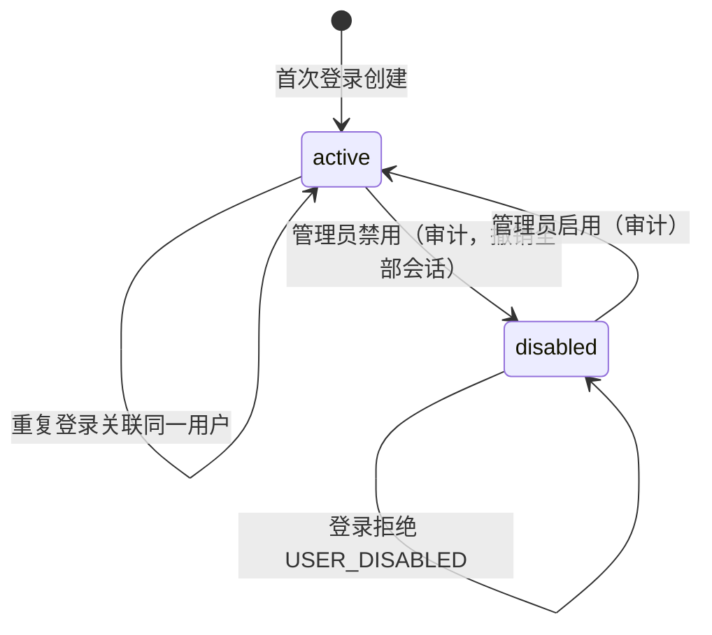
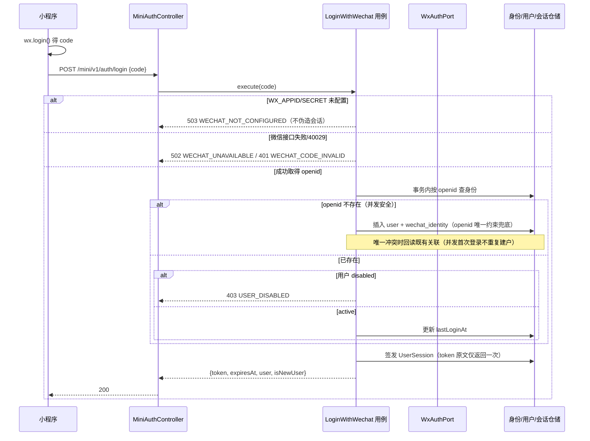
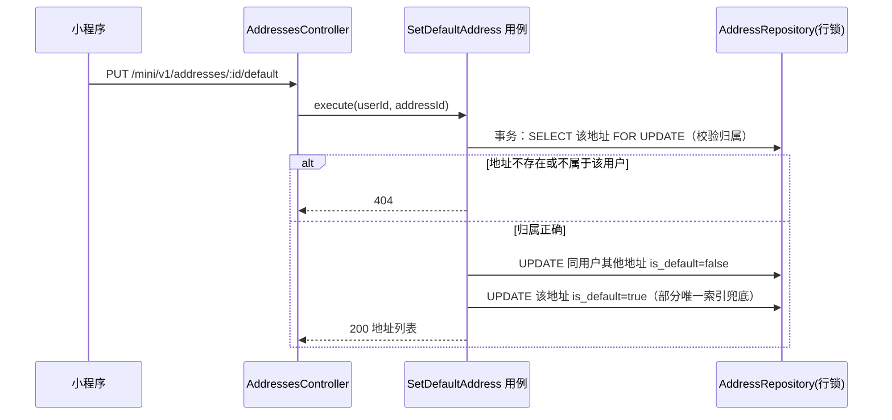

# T003 领域驱动设计

关联：[T003 spec](spec.md)、[T002 ddd](../T002-catalog-admin-media/ddd.md)、[AGENTS 领域划分](../../../AGENTS.md)。归属 IdentityAccess 上下文，不修改上下文边界；Audit 协作记录管理员敏感操作。

## 1. 统一语言

| 术语 | 英文 | 含义 |
| --- | --- | --- |
| 用户 | User | IdentityAccess 聚合根；小程序使用者，与 T002 的 Admin 完全分离 |
| 微信外部身份 | WechatIdentity | 独立聚合；openid 唯一事实，登录并发落点 |
| 用户会话 | UserSession | 实体；小程序端登录态，token 哈希落库 |
| 绑定手机号 | VerifiedPhone | 值对象；由微信手机号组件验证事实产生，非客户端提交 |
| 收货地址 | Address | 聚合根；用户资料，可被删除；未来订单保存的是不可变地址快照（交易阶段实现） |
| 账号状态 | UserStatus | active / disabled；禁用拒绝登录并使既有会话失效 |
| 游客 | Guest | 未登录状态；可浏览商品，不能访问身份类接口 |

## 2. 聚合与不变量

### 2.1 User（聚合根）

- 属性：`userId`、`nickname`（1–30 字符，默认"微信用户"，用户可改）、`phone`（E.164 无区号，可空）、`phoneCountryCode`（默认 86）、`phoneVerifiedAt`（验证事实时间，可空）、`phoneSource`（`wechat_quick_verify`，可空）、`status`（active/disabled）、`createdAt`、`lastLoginAt`。
- 不变量：昵称非空且 ≤30 字符；`phone` 非空必须伴随 `phoneVerifiedAt` 非空（手机号只能来自验证事实）；管理员接口不提供修改用户资料/手机号的入口（身份与验证事实不可被后台篡改）。

### 2.2 WechatIdentity（独立聚合）

- 属性：`identityId`、`openid`（唯一）、`unionid`（可空）、`userId`、`boundAt`。
- 不变量：**openid 全局唯一**（数据库唯一约束兜底并发首次登录）；一个微信身份只能关联一个用户（MVP 1:1；开放平台 unionid 合并多端身份留待后续任务）。

### 2.3 UserSession（实体，归属登录域）

- 属性：`sessionId`、`userId`、`tokenHash`（sha256，唯一）、`expiresAt`、`revokedAt`、`createdAt`。
- 不变量：过期或撤销即失效；与 AdminSession 同构但独立表，**两类 token 不可互用**（认证域隔离）。
- TTL 决策：默认 **14 天（20160 分钟，`USER_SESSION_TTL_MINUTES` 可配）**，绝对过期无滑动续期；**退出登录仅撤销当前会话**（不做全设备踢出——小程序单用户设备少、重登成本低；全设备退出留待有安全事件需求时再加）。

### 2.4 Address（聚合根）

- 属性：`addressId`、`userId`、`receiverName`（1–20 字符）、`phone`（1–20 字符，中国大陆手机号格式校验 `^1[3-9]\d{9}$`；**不要求等于账号绑定手机号**）、`region`（省/市/区三级文本 + 可选行政区划代码，用文本存储 `province|city|district` 三字段）、`detail`（5–120 字符，不含省市区重复）、`isDefault`、`createdAt`、`updatedAt`。
- 不变量：
  - 归属唯一：所有读写必须校验 `userId`（应用层强制，仓储查询带 userId 条件）；
  - 每用户上限 **20 条**（创建时超限 409 `ADDRESS_LIMIT_REACHED`）；
  - **同一用户至多一个默认地址**：数据库部分唯一索引 `UNIQUE(user_id) WHERE is_default`，应用层"设默认"在行锁事务内先清旧默认再置新默认（覆盖并发设置默认）；
  - 首次新增地址**不自动设为默认**（由用户显式设置；无默认态合法，交易阶段下单时明确提示选择地址）；
  - 删除默认地址后**不自动补默认**（保持无默认态，行为可预测；决策记录于 spec，后续交易任务可改）；
  - 删除为物理删除；**未来订单保存的是下单时刻的地址快照**（交易阶段实现），因此删除不影响历史交易。

## 3. 微信端口（领域不依赖 SDK）

```
WxAuthPort { exchangeCodeForSession(code) → {openid, unionid?} }        // code2Session
WxPhonePort { exchangePhoneNumberCode(code, openid?) → {purePhoneNumber, countryCode} }
WxAccessTokenPort { getToken() → string }                                // stable_token 缓存
```

- 实现位于 `adapters/outbound/wechat`：HTTP 适配器用 Node 全局 fetch；`WX_APPID`/`WX_APP_SECRET` 缺失时构造即进入"未配置"状态，登录用例返回 503 `WECHAT_NOT_CONFIGURED`，**不返回任何会话**。
- 测试注入内存假端口（仅存在于测试装配，生产不可切换）。
- 错误映射：40029 → 401 `WECHAT_CODE_INVALID`（提示重新登录）；-1/45011/网络失败 → 502 `WECHAT_UNAVAILABLE`；40226 → 403 `WECHAT_RISK_BLOCKED`；手机号 40013/40029 → 400 `PHONE_CODE_INVALID`。

## 4. 认证域与守卫

- 三个 realm：`public`（无认证）、`admin`（T002 AdminSession）、`user`（本任务 UserSession）。
- 守卫按路由元数据 `@AuthRealm('user'|'admin')` 分派；默认（无标记）为 admin 默认拒绝；mini 受保护控制器类级标注 `user`。同一请求 token 只在所属域内校验，**admin token 不能访问用户接口，反之亦然**。

## 5. UML 类图



## 6. 状态图（User 账号）



## 7. 时序图

### 7.1 微信登录（含失败与并发路径）



### 7.2 设置默认地址（并发唯一性）



## 8. 存储与端口（新增）

- 迁移：0006 `users` + `user_wechat_identities`（openid 唯一）、0007 `user_sessions`（token_hash 唯一）、0008 `user_addresses`（默认地址部分唯一索引、CHECK 长度）。
- 出站端口：`UserRepository`、`WechatIdentityRepository`、`UserSessionRepository`、`AddressRepository`（全部带 userId 作用域方法）、`PasswordHasher/TokenService` 复用 T002 crypto 适配器。
- 复用：`RecordOperation`（Audit）记录管理员敏感操作；`AdminAuthGuard` 机制扩展为 realm 分派。
- 未来下单的预留：`UserRepository.findByIdIfActive` 与 `AddressRepository.listByUser`（登录用户读自己地址）即为订单阶段取身份/地址的唯一入口；订单地址快照属交易阶段。
