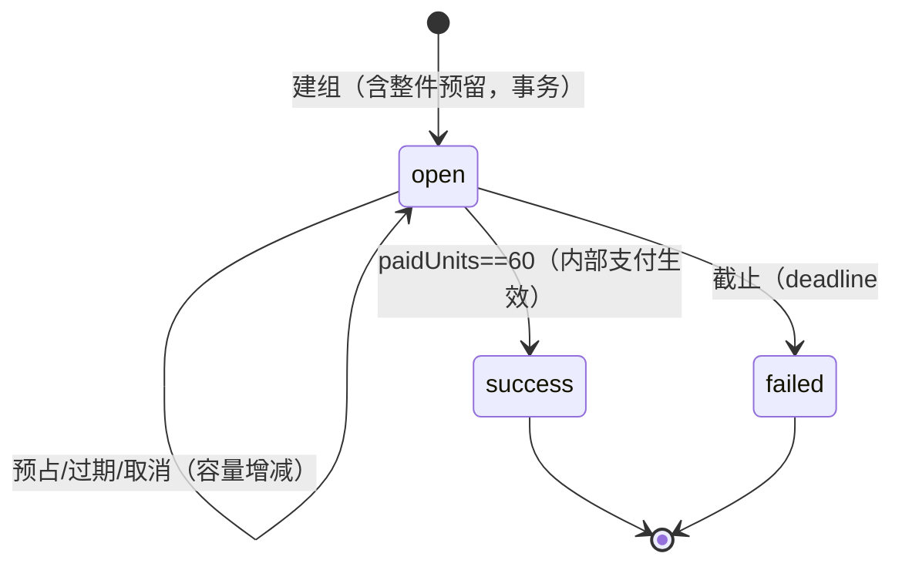
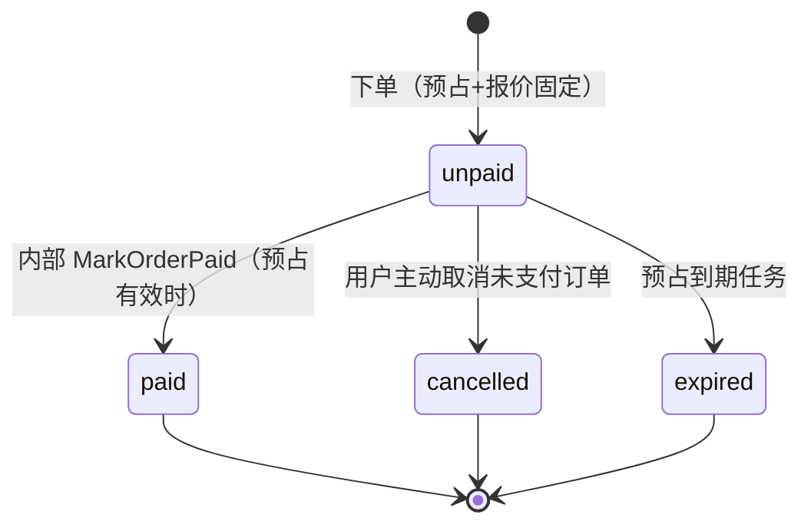
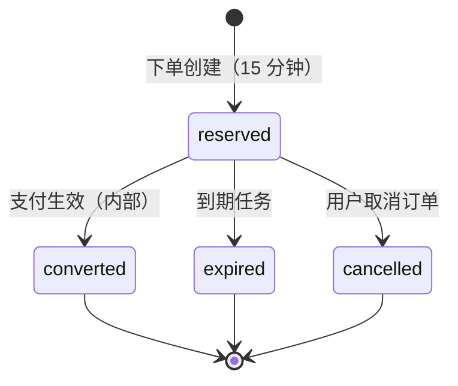
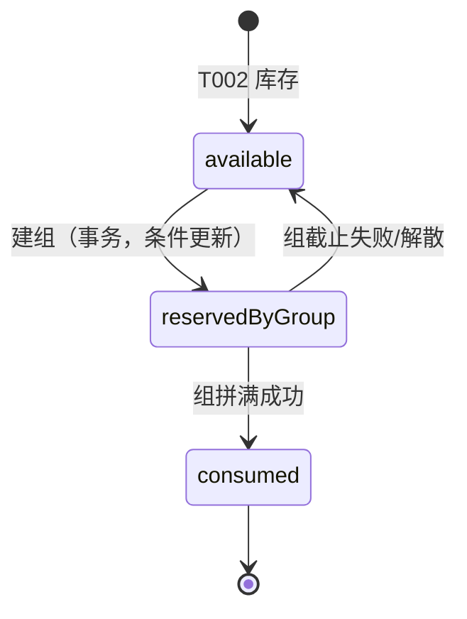
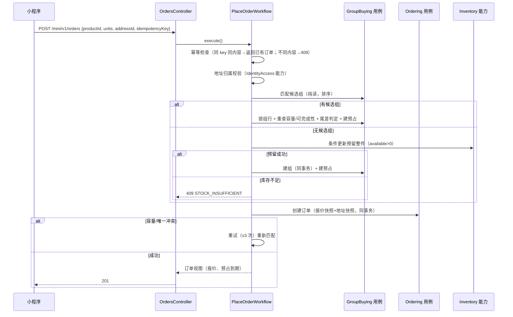
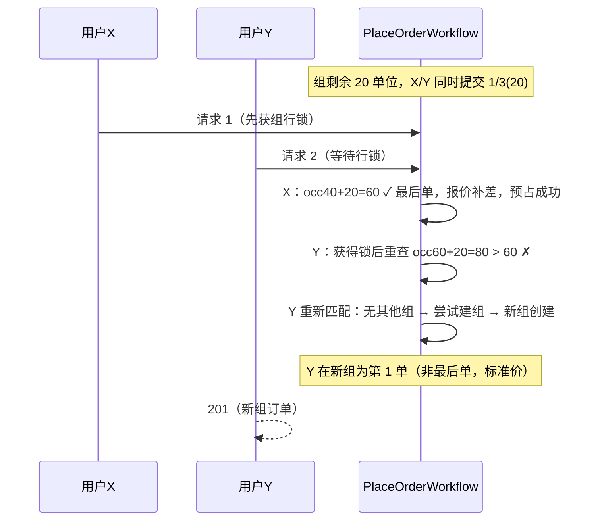
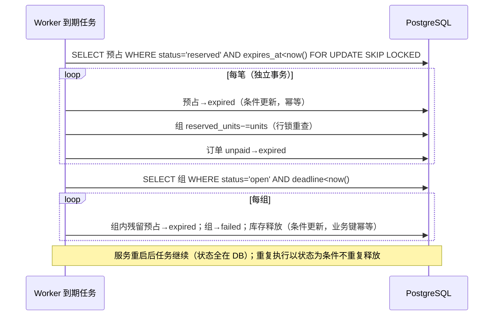
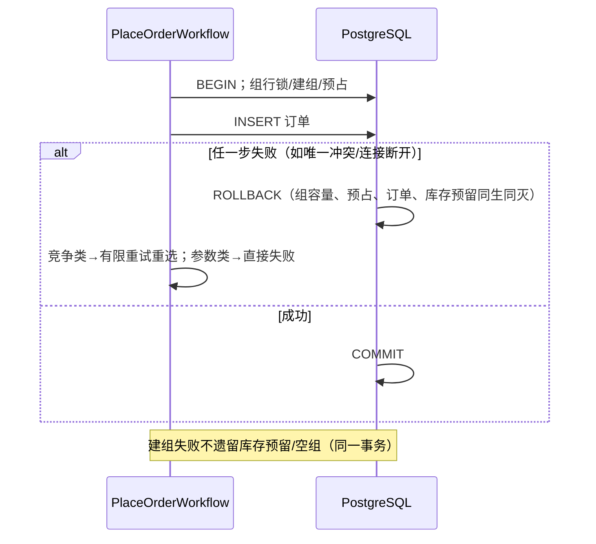

# T004 领域驱动设计

关联：[T004 spec](spec.md)、[决策记录](decisions/)（D001–D005 已确认）、[AGENTS 领域划分](../../../AGENTS.md)。

## 1. 领域认领与职责边界

| 上下文 | 本任务职责 | 不做 |
| --- | --- | --- |
| GroupBuying（主） | Group（容量/状态/快照）、ShareReservation、可完成性纯函数（Completeness）、组匹配规则（GroupMatching）、组满判定 | 不写订单表、不动库存表（经 Inventory 公开能力） |
| Ordering（主） | Order（报价快照/地址快照/状态）、OrderNumber、下单工作流编排、订单查询投影 | 不直接改组容量（经 GroupBuying 公开能力） |
| Inventory | 整件预留/消耗/释放（扩展 T002 Stock）、防重留痕 | 不理解组语义（reason 由调用方给） |
| Catalog | 商品可售状态与快照字段读取、`group_deadline_hours` 配置 | 不参与匹配计算 |
| IdentityAccess | 用户会话认证（已有）、地址归属校验（已有能力） | — |
| Audit | 建单、取消、内部支付生效、组成功/失败等关键操作记录 | 不参与业务决策 |

跨上下文协作一律走应用层公开用例/端口；Ordering 工作流（`workflows/`）编排"匹配→报价→订单→预占→库存"事务，但**份额容量计算、可完成性、尾差定价保留在 GroupBuying/Ordering 领域内**。

## 2. 统一语言

| 术语 | 英文 | 含义 |
| --- | --- | --- |
| 拼单组 | Group | 一个整件的一份拼单；容量 60 单位；带快照与截止时间 |
| 份额预占 | ShareReservation | 下单后占用的份额单位，15 分钟有效；不计入已支付 |
| 已生效/已支付单位 | paidUnits | 支付生效后转正的份额单位；paid==60 时组成功 |
| 剩余容量 | remainingCapacity | 60 − paidUnits − 有效 reservedUnits |
| 可完成性 | Completeness | 剩余容量能否由组快照允许份额精确凑出（整数 DP） |
| 最后单 | FinalOrder | 预占时恰好填满 60 单位的订单，承担尾差（D001） |
| 报价 | Quote | 下单固定的应付金额（含通用价、尾差调整、商品/服务费拆分） |
| 整件预留 | StockReservation | 组对一整件库存的占用（available→reserved） |

## 3. 聚合与不变量

### 3.1 Group（聚合根，GroupBuying）

- 属性：`groupId`、`productId`、`salePolicySnapshot`（{originalPriceFen, allowedShareUnits, wholeQuantityText, unit, userWholePriceFen}）、`deadline`、`status(open|success|failed)`、`paidUnits`、`reservedUnits`、`paidAmountFen`、`paidGoodsAmountFen`、`createdAt/updatedAt`。
- 不变量：
  - `0 ≤ paidUnits ≤ 60`；`paidUnits + reservedUnits ≤ 60`（DB CHECK + 事务内行锁重查）；
  - `reservedUnits ≥ 0`；预占不计入 paidUnits；
  - `status=open` 时才可接受新预占；`success/failed` 终态不可逆；
  - `paidUnits == 60 ⟺ status=success`（同一事务内原子迁移）；
  - 快照不可变（D003）；
  - `deadline` 建组时固化。
- 实体：无独立子实体；预占是**独立聚合**（不同生命周期与一致边界）。

### 3.2 ShareReservation（聚合根，GroupBuying）

- 属性：`reservationId`、`groupId`、`orderId`（唯一）、`units`、`status(reserved|converted|expired|cancelled)`、`expiresAt`、`createdAt`、`convertedAt`。
- 不变量：`units ∈ 组快照允许集合`；orderId 唯一（一单一预占）；`reserved → converted | expired | cancelled` 单向；converted 仅由内部 MarkOrderPaid 触发。

### 3.3 Order（聚合根，Ordering）

- 属性：`orderId`、`orderNo`（`PO + yyyyMMdd + 10 位随机`，唯一）、`userId`、`productId`、`groupId`、`units`、`status(unpaid|paid|cancelled|expired)`、`quote{totalAmountFen, goodsAmountFen, serviceFeeFen, tailAdjustFen, isFinalOrder}`、`snapshot{originalPriceFen, unit, wholeQuantityText, referenceQuantityText}`、`addressSnapshot{receiverName, phone, province, city, district, detail}`、`reservationExpiresAt`、`idempotencyKey`、`paidAt/cancelledAt/expiredAt`、`createdAt/updatedAt`。
- 不变量：
  - 金额整数分；`totalAmountFen = goodsAmountFen + serviceFeeFen`；
  - `tailAdjustFen` 仅 `isFinalOrder=true` 时可非零，且 `total = half-up(通用价) + tailAdjust`；
  - 快照不可变（商品/地址后续修改不改写订单）；
  - 地址快照仅来自归属校验通过的用户地址（下单时由 IdentityAccess 能力校验）；
  - `unpaid → paid | cancelled | expired` 单向，终态不可逆；
  - `idempotencyKey` 按 `(userId, key)` 唯一。

### 3.4 Stock（扩展，Inventory）

沿用 T002 聚合，新增语义：`reservedWholeItems` 由组占用（建组 +1、成功 −1 转 consumed 口径、失败/解散 −1 回 available）；变动留痕沿用 `stock_movements`，幂等键复用 `(product_id, request_id)` 唯一索引（request_id 传 `group-create:{groupId}` 等业务键格式）。

## 4. 领域服务（纯函数，TDD 核心）

### 4.1 Completeness（可完成性，GroupBuying）

```
computeCompletable(allowedUnits: ShareUnits[]): boolean[0..60]
  // dp[0]=true；dp[s]=∃u∈allowed, s≥u 且 dp[s−u]。O(60×|S|)
canJoin(allowedUnits, remaining, myUnits): boolean
  // remaining>0 && myUnits∈allowed && myUnits≤remaining && dp[remaining−myUnits]
```

不允许浮点；不允许贪心猜测。`remaining==0` 不可加入（组满）。

### 4.2 GroupMatching（匹配规则，GroupBuying）

候选组条件：`status=open && deadline>now && productId 匹配 && remaining≥myUnits && canJoin(快照份额, remaining, myUnits)`。
排序（需求 §2.4）：`remaining 升序`（最接近拼满优先）→ `createdAt 升序`（稳定）。查询层只出候选；**写入事务内对选中组行锁重查容量与可完成性**。竞争失败 → 有限重试（3 次）重新匹配，仍失败返回 `SHARE_CAPACITY_CONFLICT`。

### 4.3 QuotePricing（报价，Ordering）

```
quote(originalPriceFen, units, isFinalOrder, groupPaidAmountFen, groupPaidGoodsFen):
  whole = originalPriceFen + 500
  standard = floor((whole×units + 30)/60)
  standardGoods = floor((originalPriceFen×units + 30)/60)
  若 isFinalOrder:
    total = whole − groupPaidAmountFen
    goods = originalPriceFen − groupPaidGoodsFen
    tail = total − standard（可为负）
  否则 total=standard, goods=standardGoods, tail=0
  serviceFee = total − goods
  不变量：total ≥ 0；组成功时 Σtotal == whole、Σgoods == originalPriceFen、ΣserviceFee == 500
```

最后单判定：`group.paidUnits + 其他有效预占 + myUnits == 60`——预占事务内同一行锁下计算，唯一性由容量约束保证。

## 5. 状态图

### Group



### Order



### ShareReservation



### Stock（整件，事件视角）



## 6. 关键时序

### 6.1 提交订单（正常 + 建组 + 竞争重试）



### 6.2 最后份额竞争（两人同买最后 20 单位）



### 6.3 预占过期与重复任务



### 6.4 失败回滚（数据库失败）



## 7. 存储设计（迁移 0009–0013）

| 迁移 | 内容 |
| --- | --- |
| 0009 | `groups`（快照 jsonb、deadline、status CHECK、paid/reserved_units CHECK、product 索引）；`share_reservations`（order_id 唯一、status、expires_at 索引） |
| 0010 | `orders`（order_no 唯一、(user_id, idempotency_key) 唯一、status CHECK、金额 CHECK total=goods+service、地址快照列、user/group 索引） |
| 0011 | `products` 增列 `group_deadline_hours integer NOT NULL DEFAULT 24 CHECK BETWEEN 1 AND 168` |
| 0012 | 组辅助索引（status+deadline、product+status）；组 CHECK `paid_units+reserved_units<=60` |
| 0013 | （预留）审计无需变更——复用 admin_operation_logs；如实现中发现需要再补 |

命名沿用 T002/T003 风格；金额整数分；时间 timestamptz。

## 8. 端口

`GroupRepository`（findByIdForUpdate/findCandidates/insert/updateCapacity…）、`ShareReservationRepository`（insert/findByOrderId/findExpired/transition…）、`OrderRepository`（findByIdempotency/insert/transition…）、`StockReservationPort`（Inventory 公开能力：reserveOne(product, idempotencyKey, tx)/releaseOne/consumeOne）、`ProductSnapshotPort`（Catalog 公开能力：getSellableSnapshot(productId) → {snapshot, deadlineHours, onShelf}）、`AddressOwnershipPort`（复用 T003 AddressRepository 能力）、`Clock`、`TransactionRunner`（已有）、`NumberGenerator`（orderNo）。

## 9. 复用与新增

复用：T002 NestJS 装配/requestId/错误过滤/迁移器/audit/守卫、T003 user realm 守卫、TokenService、TransactionRunner、架构检查、tests/task-suites 组织。
新增：无新依赖（DP 算法纯 TS；到期任务复用 Worker 进程内循环 + DB 状态，不引入队列）。
