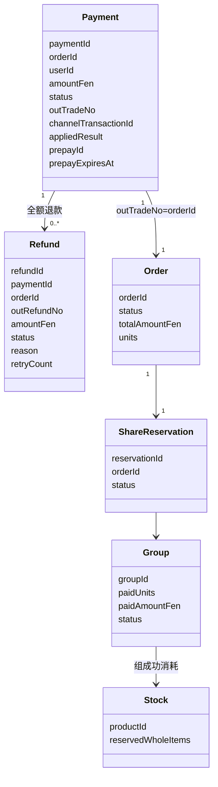
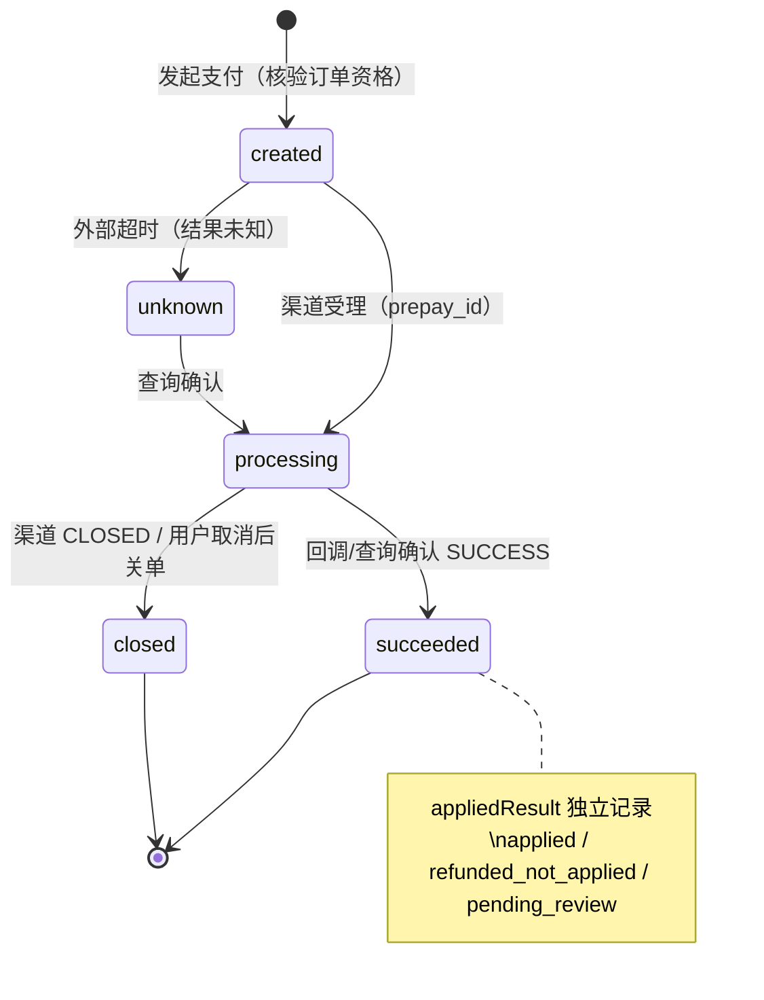
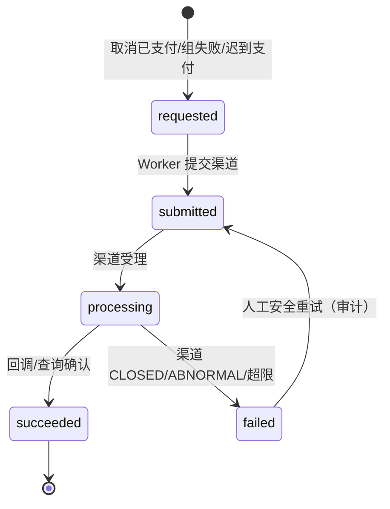
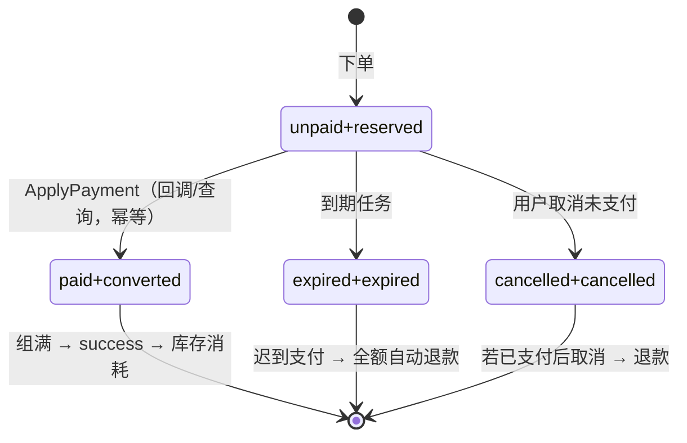
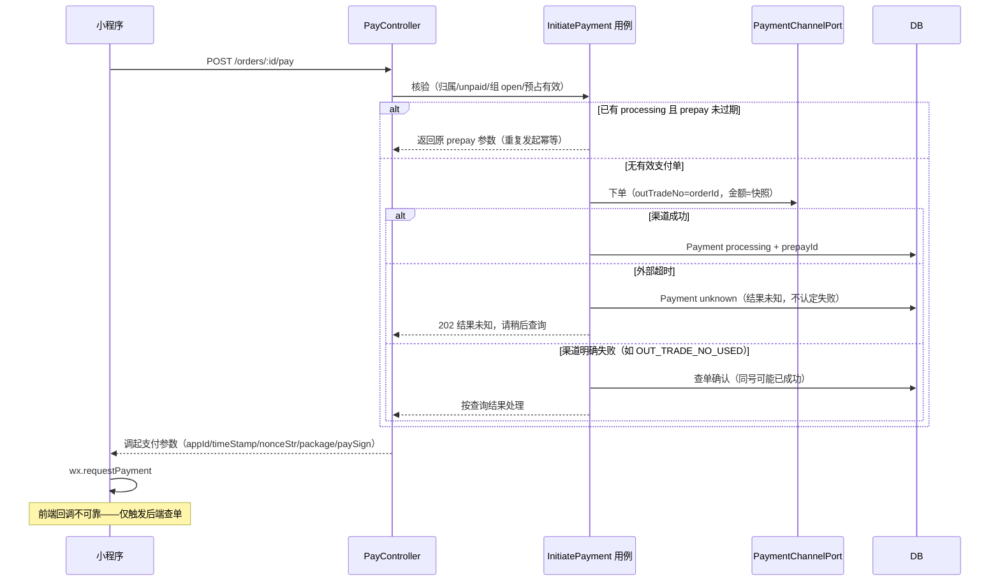
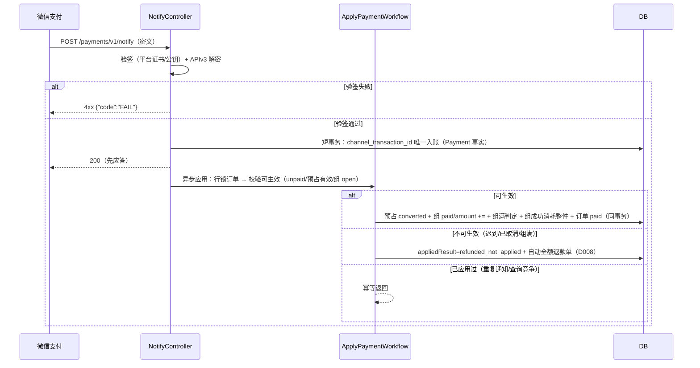
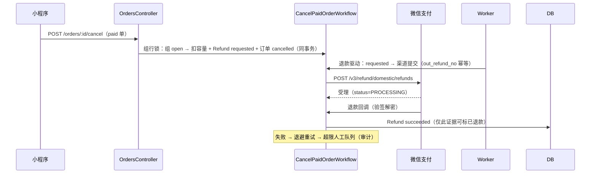
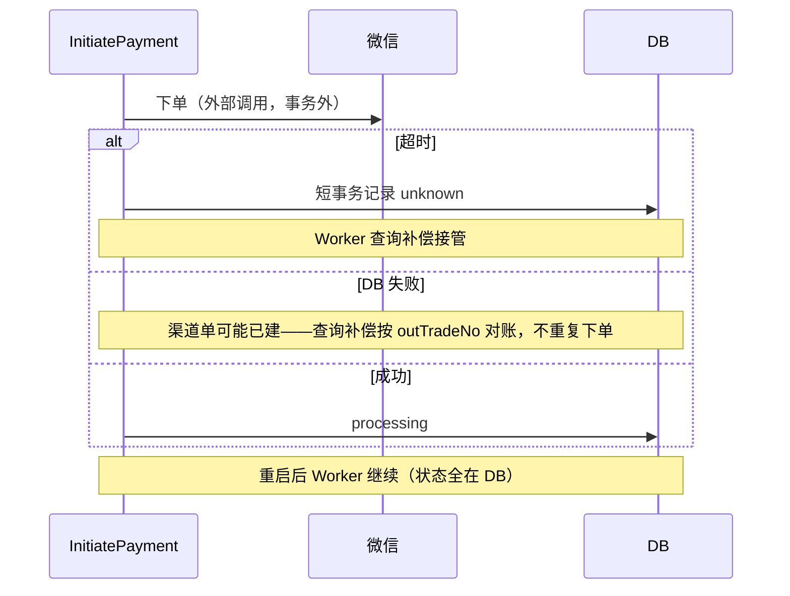

# T006 领域驱动设计

关联：[T006 spec](spec.md)、[决策 D006–D010](decisions/)（2026-10-01 用户确认）。

## 1. 领域认领与职责边界

| 上下文 | 本任务职责 | 不做 |
| --- | --- | --- |
| Payments（主） | Payment（支付单/渠道事实）、Refund（退款单五态）、渠道端口（下单/查单/关单/退款/验签解密）、回调入站、查询补偿规则 | 不改组容量/订单状态本身（经公开能力协调） |
| GroupBuying（协作） | 支付生效：预占转已支付、组满判定（复用 T004 markPaidUnits/markSuccess）、组成功消耗整件（复用 F014 ConsumeStock） | 不理解支付单 |
| Ordering（协作） | 订单状态迁移（unpaid→paid/cancelled→expired）、支付单关联查询 | 不直接写渠道事实 |
| Inventory | 组成功消耗整件（已有能力） | — |
| Audit | 后台退款重试等操作审计 | — |

跨领域协作统一走工作流（`workflows/`）+ 公开端口；**份额生效、组满判定、库存消耗保持各自领域实现**，工作流只编排。

## 2. 统一语言

| 术语 | 英文 | 含义 |
| --- | --- | --- |
| 支付单 | Payment | 一次支付意图与渠道事实的聚合；一个订单可多次发起尝试，但只有一条生效事实 |
| 渠道交易号 | ChannelTransactionId | 微信 transaction_id，渠道事实唯一键 |
| 商户订单号 | OutTradeNo | 提交给微信的 out_trade_no = 订单号（UUID），天然唯一 |
| 支付生效 | ApplyPayment | 预占转已支付 + 组容量/金额更新 + 组满判定的原子流程（幂等） |
| 退款单 | Refund | 五态退款聚合；out_refund_no = `RF-{orderId}-{n}` |
| 迟到支付 | LatePayment | 订单不可生效时收到渠道成功 → 全额自动退款（D008） |
| 未应用支付 | NotAppliedPayment | 支付成功事实已入库但因订单状态无法生效的记录 |

## 3. 聚合与不变量

### 3.1 Payment（聚合根，Payments）

- 属性：`paymentId`、`orderId`（唯一，一单一生效支付单）、`userId`、`amountFen`（= 订单快照 totalAmountFen，渠道提交与核验同源）、`status(created|processing|succeeded|closed|unknown)`、`outTradeNo`（= orderId）、`channelTransactionId`（唯一，可空）、`appliedResult(applied|refunded_not_applied|pending_review|—)`、`prepayId`、`prepayExpiresAt`、`channelPayload`（成功通知解密报文，证据）、`createdAt/updatedAt`。
- 不变量：
  - `amountFen` 来自订单快照，发起与回调核验一致（不一致 → 异常证据 + pending_review）；
  - `succeeded` 必须有 `channelTransactionId` 与成功来源（callback/query）；
  - `channelTransactionId` 全局唯一（渠道事实不重复入账）；
  - 生效应用幂等：applied 状态不可重复应用；
  - 订单不可生效（expired/cancelled/组满/组 failed/截止已过）时不得应用 → 走 D008 全额自动退款。

### 3.2 Refund（聚合根，Payments）

- 属性：`refundId`、`paymentId`、`orderId`、`userId`、`outRefundNo`（`RF-{orderId}-{seq}`，唯一）、`amountFen`（= 实付，全额）、`status(requested|submitted|processing|succeeded|failed)`、`reason(user_cancel|group_failed|late_payment)`、`retryCount`、`channelRefundId`、`failReason`、`createdAt/updatedAt`。
- 不变量：
  - `amountFen == 关联 Payment 实付`（全额退款，含服务费）；
  - `Σ(该 Payment 下 non-failed 退款) ≤ 实付`（应用层断言 + DB 触发器级校验由应用保证）；
  - 五态单向：requested → submitted → processing → succeeded | failed（failed 可人工重试回 submitted）；
  - `succeeded` 仅由渠道回调/查询确认写入；
  - `outRefundNo` 唯一（渠道幂等键）。

### 3.3 渠道事实与状态映射

- 渠道 `trade_state`: SUCCESS→succeeded；REFUND→succeeded（订单存在退款记录）；CLOSED→closed；NOTPAY→processing（继续等）；REVOKED/USERPAYING/PAYERROR→单测覆盖，异常进 pending_review。
- 渠道退款 `status`: SUCCESS→succeeded；PROCESSING→processing；CLOSED→failed（可重试）；ABNORMAL→failed+人工。

## 4. UML 类图

## 5. 状态图

### Payment

### Refund

### 交易闭环总览（订单/预占/组联动）

## 6. 关键时序

### 6.1 发起支付（正常 + 超时未知 + 重复发起）

### 6.2 支付确认（回调 + 查询竞争 + 幂等）

### 6.3 退款（用户取消已支付 → 渠道 → 回调确认）

### 6.4 失败与恢复（外部超时/DB 失败/重启）

## 7. 存储设计（迁移 0011–0013）

| 迁移 | 内容 |
| --- | --- |
| 0011 | `payments`（order_id 唯一、out_trade_no 唯一、channel_transaction_id 唯一、status/applied_result CHECK、金额 CHECK=订单 total、prepay 过期索引） |
| 0012 | `refunds`（out_refund_no 唯一、payment_id 索引、五态 CHECK、reason 枚举、retry_count） |
| 0013 | `payment_channel_events`（回调/查询原始证据：通知 ID、类型、密文、解密摘要，用于异常留痕与审计） |

## 8. 端口（domain/application 声明，adapters/outbound/wechat 实现）

`PaymentChannelPort`：`createJsapiOrder({outTradeNo, amountFen, openid, description, notifyUrl})` → `{prepayId}`；`queryOrderByOutTradeNo(outTradeNo)` → `{tradeState, transactionId?, payerTotal?}`；`closeOrder(outTradeNo)`；`submitRefund({outTradeNo, outRefundNo, refundFen, totalFen, reason})`；`queryRefund(outRefundNo)`；`verifyNotifySignature(headers, rawBody)` → `{valid, decrypted?}`。
配置端口 `PayConfigPort`：mchid/appid/serialNo/私钥/APIv3 密钥/notifyUrl——缺失时渠道端口进入"未配置"状态，发起支付返回 503 `WECHAT_PAY_NOT_CONFIGURED`。
测试替身 `FakePaymentChannelPort` 仅在测试装配注入。
