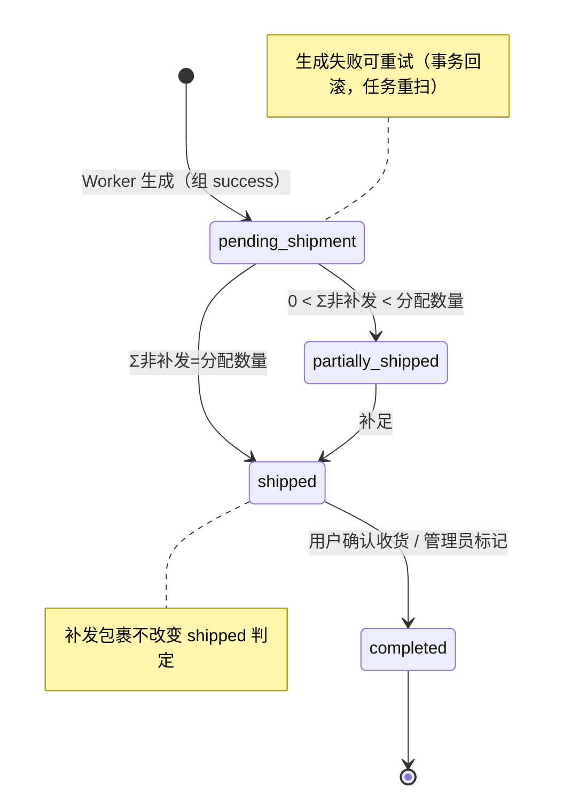
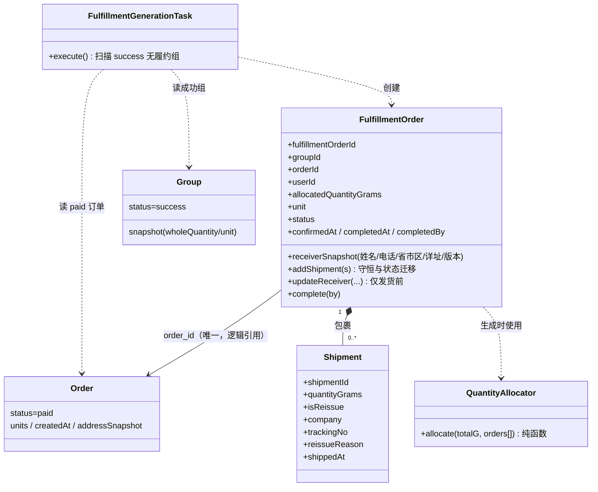
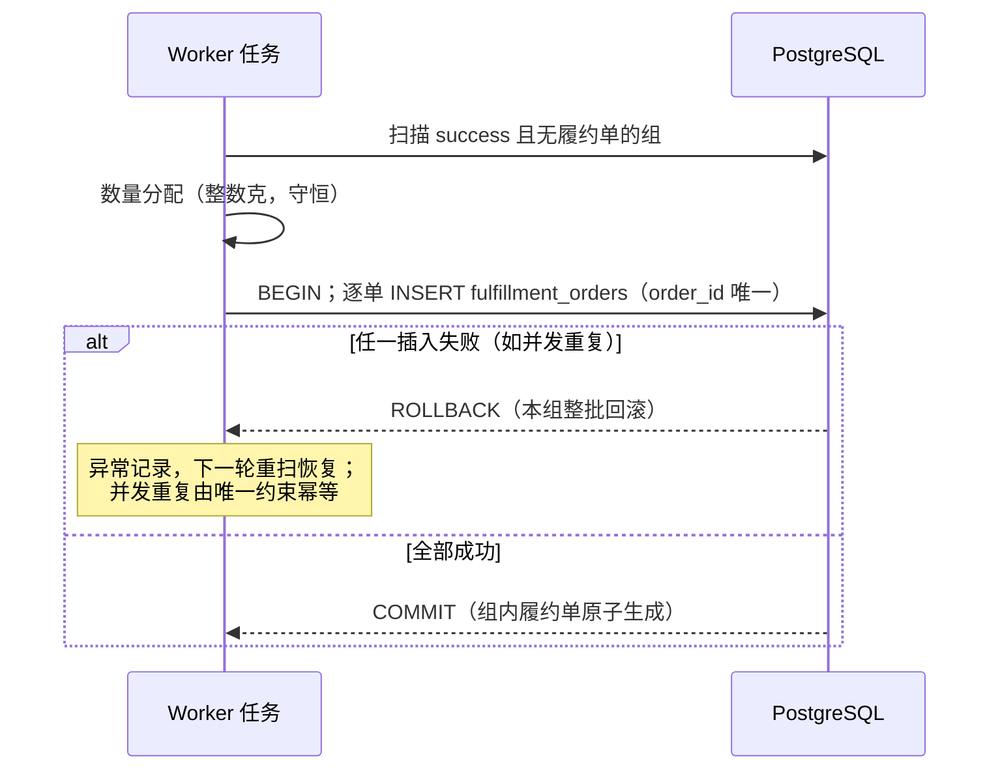
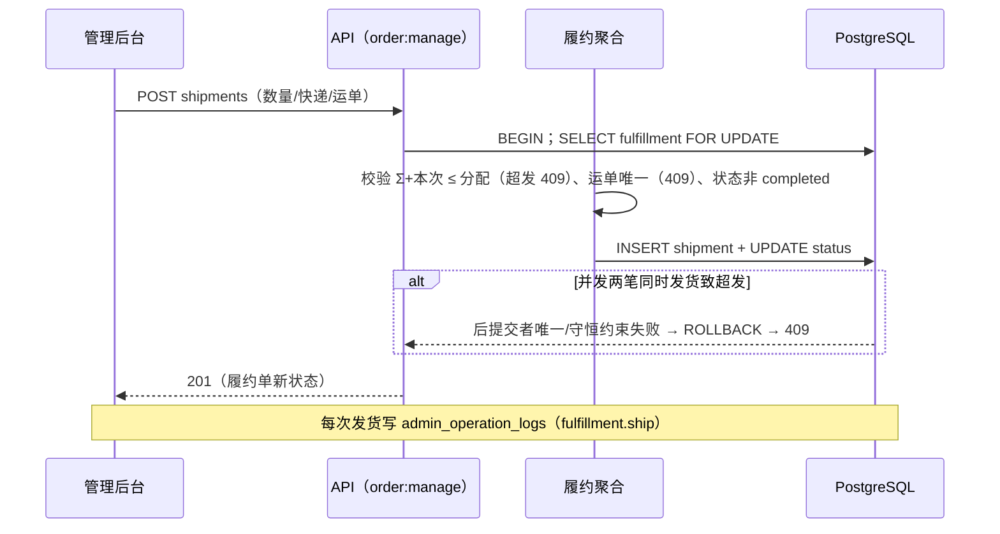
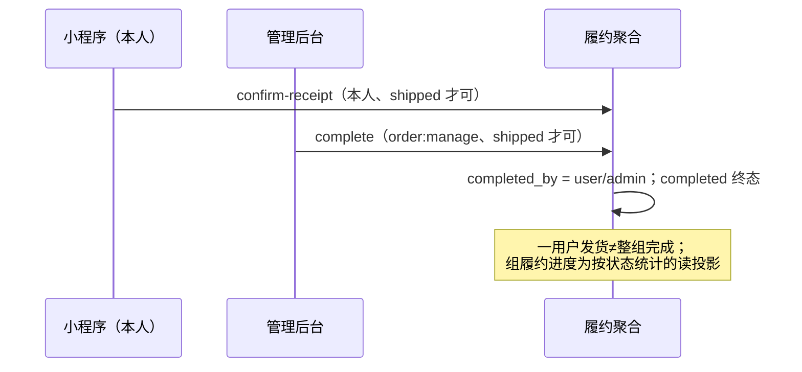

# T007 领域设计（DDD）

## 1. 领域认领与职责边界

- **Fulfillment（主）**：履约单（FulfillmentOrder，聚合根）、包裹（Shipment，实体）、数量分配（领域服务）、履约状态投影。拥有发货事实与履约状态，不修改订单/支付/组状态。
- **GroupBuying（协作，只读）**：提供成功组事实（status=success、快照 whole_quantity/unit、整件数量克数换算）。
- **Ordering（协作，只读）**：提供有效已支付订单（paid）、订单创建顺序（尾差分配序）、地址快照（收货信息初始来源）。
- **IdentityAccess（协作，只读）**：昵称投影。
- **Audit（协作）**：发货/补发/改址/完成/导出写 `admin_operation_logs`。
- 跨领域协作全部经应用服务/Worker 任务 + 仓储端口，不越界访问他域内部；未来售后工单通过公开用例（如 `FulfillmentQueries` 只读投影）衔接，本轮不实现客服/售后。

## 2. 统一语言

- **履约单（FulfillmentOrder）**：一位有效用户对其一笔 paid 订单的履约事实，含分配数量（克）与收货快照。
- **包裹（Shipment）**：一次实际寄发：快递公司+运单号+本次寄发数量（克）；`is_reissue=true` 为补发（不计入发货进度）。
- **分配数量（allocatedQuantityGrams）**：按 D011 由组整件克数与订单份额一次性算定，不可变。
- **发货进度**：Σ 非补发包裹数量 / 分配数量；`shipped` ⇔ 相等。

## 3. 聚合与不变量

### 3.1 FulfillmentOrder（聚合根）

- 状态：`pending_shipment → partially_shipped → shipped → completed`（含 `pending_shipment → shipped` 直达；`completed` 终态；任何状态不可回退）。
- 不变量：
  - I1 `order_id` 全局唯一（重复事件/任务不重复生成）；
  - I2 分配数量 > 0，由 D011 算法一次算定，生成后不可变；
  - I3 Σ非补发包裹数量 ≤ 分配数量（禁止超发）；`= 分配数量` ⇔ status ∈ {shipped, completed}（守恒发货）；
  - I4 `completed` 仅可自 `shipped`；`completed_by ∈ {user, admin}`；
  - I5 收货快照发货后锁定（仅 `pending_shipment`/`partially_shipped` 可管理员修改，版本号递增）；
  - I6 包裹运单号 (company, tracking_no) 全局唯一。

### 3.2 Shipment（实体，聚合内）

- 创建即发货（录入运单即发货事实，无草稿态）；数量 ≥ 0（补发允许 0=仅补寄凭证场景？——不允许：补发数量必须 >0）；`shipped_at` 服务端时钟。

### 3.3 数量分配（领域服务，纯函数）

- 输入：整件克数 totalG（= whole_quantity × 500，必须为非负整数，非整数克商品在生成时拒绝并留痕）、订单列表 [{orderId, units, seq}]（seq=订单创建顺序）。
- 输出：[{orderId, grams}]；`base_i = floor(totalG × units_i / 60)`，`R = totalG − Σbase_i`，前 R 单（seq 序）各 +1。
- **守恒证明**：Σbase_i ≥ Σ(totalG×units_i/60 − 1) = totalG − n ⇒ 0 ≤ R < n（n=订单数）；Σgrams = Σbase_i + R = totalG。∎

## 4. 状态机

## 5. UML 类图

## 6. 关键时序（含失败/竞争路径）

### 6.1 生成（失败可重试）

### 6.2 发货（竞争与超发防护）

### 6.3 确认收货 / 管理员完成

## 7. 事务与跨领域边界

- 生成：每**组**一个事务（组内履约单原子生成，避免半组生成）；任务失败整批回滚重试。
- 发货/补发/改址/完成：每操作一个事务，履约行 `FOR UPDATE` 串行化同一履约单的并发发货；守恒校验在锁内。
- 组/订单/支付状态在本域**只读**；组履约进度是查询投影（COUNT GROUP BY），不回写组。
- 审计失败不阻断业务（RecordOperation 内部捕获告警）。

## 8. 独立审查修复轮（2026-10-01，D011–D014 已确认；D015 未确认）

- **审计与业务同事务**（R04）：发货/补发/改址/完成的审计在业务事务内写 `admin_operation_logs`——审计失败整体回滚，业务不会"已提交却报错"，也不会漏审计；故障后重试安全（同运单号不冲突）。导出旁路审计失败仅告警。
- **补发边界**（R06，D013 已确认）：补发在任意状态允许且**不改变状态与主进度**（状态仅由非补发 Σ推导）；completed + 非补发仍拒绝；地址锁定 = 存在任何包裹（含补发）或已发生发货。
- **单位注册表**（R01，D011 已确认）：见 ddd §3.3 与 D011——重量克化/计数整件/未知拒绝；展示回原单位；`allocated_quantity_grams` 列语义为"最小履约单位数"。
- **脱敏**（R03）：普通详情响应不含明文电话字段；明文仅经 unmasked 导出路径（写审计）。

## 2026-10-02 整改与确认

D019禁止所有合法有序组合的零分配；原历史快照不改，生成异常留痕，按T008/F036审核退款。D015已由用户明确确认：管理员无任何包裹时可改址、版本+1+审计；出现任何包裹后锁定。D020补发统一客服申请/超级管理员审核，原HTTP补发直达入口REVIEW_REQUIRED。修改及实际验收见 [T008整改最终验证](../T008-customer-service-after-sales/remediation-verification.md)，不以审计之后补充索引冒称先设计。
