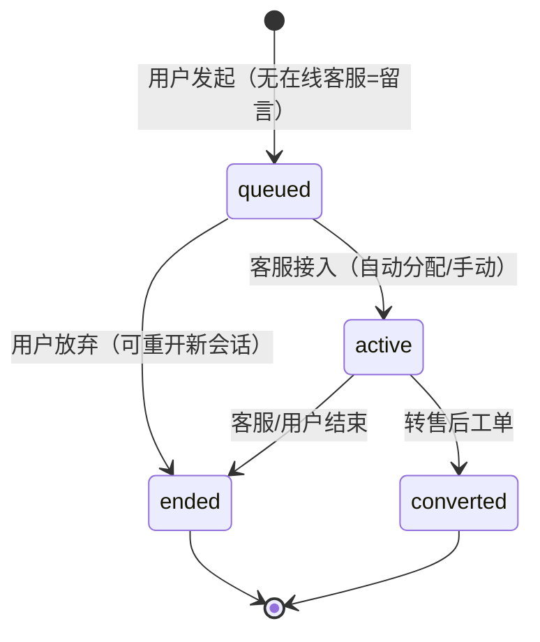
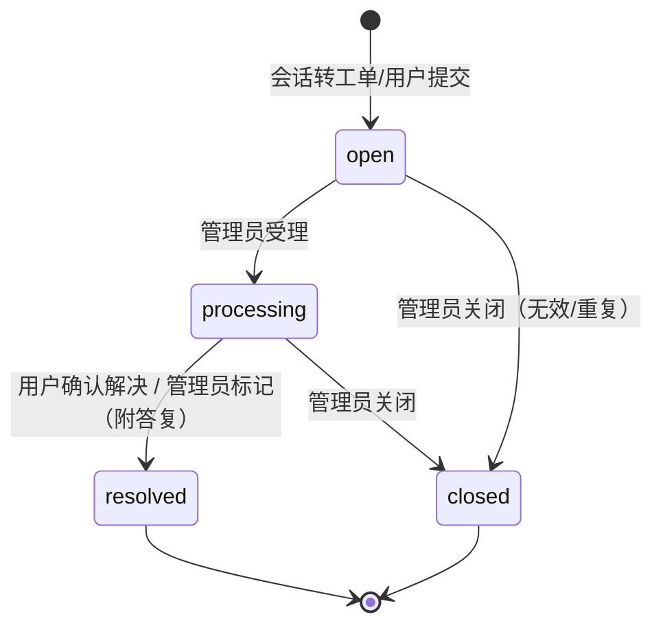
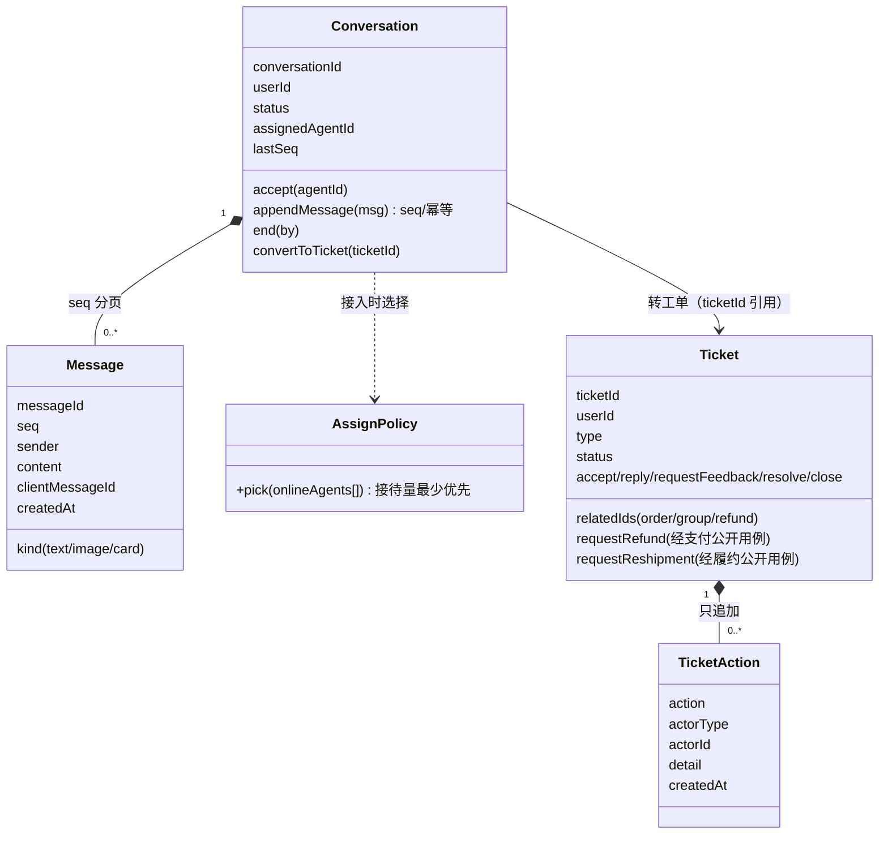
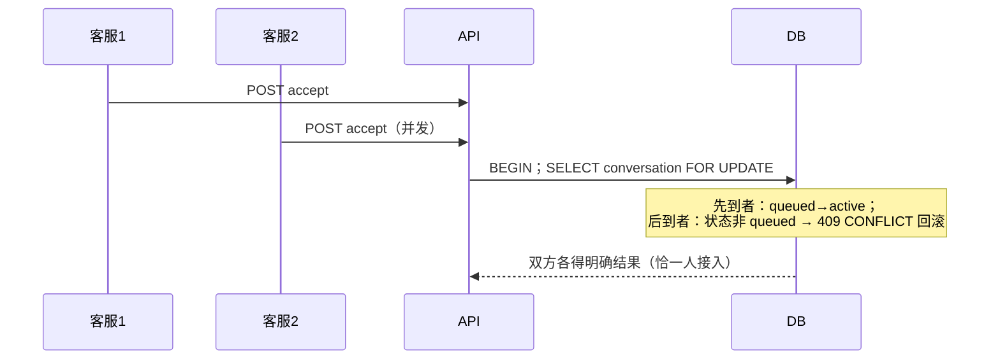
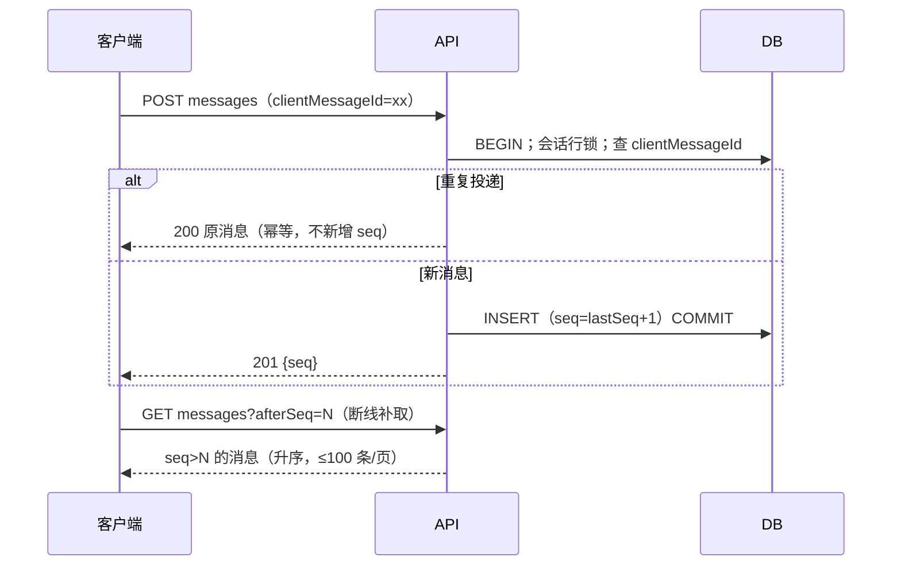
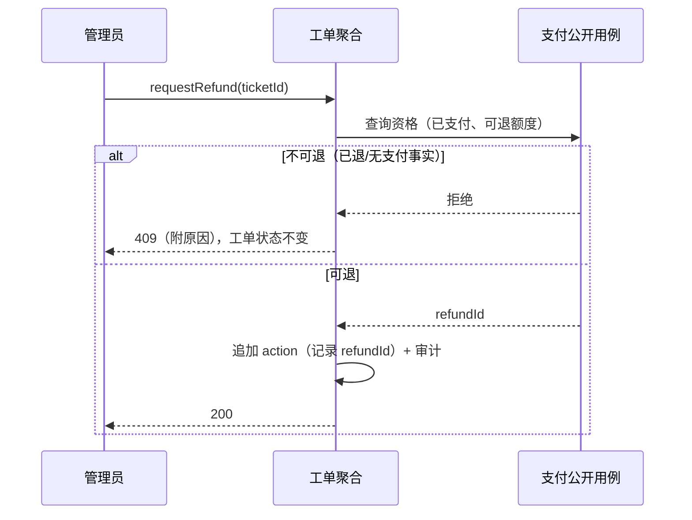

# T008 领域设计（DDD）

## 1. 领域认领与职责边界

- **CustomerService（主）**：会话（Conversation，聚合根）、消息（Message，聚合内实体，独立大表）、会话分配策略（领域服务）。拥有会话状态与消息事实。
- **AfterSales（主）**：售后工单（Ticket，聚合根）、处理记录（TicketAction）。拥有工单状态；**通过公开用例**（Payments 的退款资格查询/全额退款创建、Fulfillment 的补发）协调退款/补发，不直接改他域数据，全部动作写审计。
- **协作（只读）**：IdentityAccess（用户/客服身份与在线状态）、Catalog/Ordering/GroupBuying/Payments（卡片投影数据源）、Audit。
- 消息历史持续增长：消息独立表 + (conversation_id, seq) 索引分页，任何接口不要求全量载入。

## 2. 统一语言

- **会话（Conversation）**：一次用户↔客服咨询（含留言期）。状态：`queued（排队中/留言）→ active（接待中）→ ended（已结束）| converted（已转工单）`；active 内以 `waiting_user / waiting_agent` 表达待回复方（读投影，非状态机状态）。
- **消息（Message）**：文字/图片/卡片之一；`sender ∈ {user, agent, system}`；组内 `seq` 严格递增（幂等键 `clientMessageId`）。
- **接入（Accept）**：客服从队列领取 → active + assignedAgent。
- **转工单（Convert）**：会话 ended 或 active 时创建关联工单，会话置 converted（终态）。
- **补取（Catch-up）**：客户端带 `afterSeq` 拉取增量消息；断线重连安全。

## 3. 聚合与不变量

### 3.1 Conversation（聚合根）

- 不变量：
  - I1 消息只能追加到 `queued/active` 会话（ended/converted 只读）；
  - I2 `assignedAgent` 仅在 active 存在；转接=更换 assignedAgent（写审计）；
  - I3 seq 单调：新消息 seq = 组内最大 seq + 1（行锁/唯一约束兜底）；
  - I4 `clientMessageId` 在会话内唯一（重复投递幂等返回原消息）；
  - I5 用户只能读/发本人会话；客服只能读写分配给自己的会话（super_admin 例外只读）；
  - I6 一个用户同一时刻至多一个未结束会话（部分唯一索引）。

### 3.2 Message（聚合内实体）

- 类型校验：text ≤ 2000 字；image = mediaAssetId（T006 图片库）；card = { kind: product|order|group|refund, refId }（投影时校验归属与可见性）。

### 3.3 Ticket（聚合根）

- 状态：`open（待处理）→ processing（处理中）→ resolved（已解决）| closed（已关闭）`；`waiting_user` 为 processing 的子态投影。
- 不变量：
  - T1 创建必须关联用户，可选关联 orderId/groupId/refundId（存在性与归属校验）；
  - T2 resolved/closed 终态；closed 可由 open/processing 直接关闭（用户撤回/管理员驳回）；
  - T3 处理记录（TicketAction）只追加：受理/回复/发起退款/发起补发/请求用户反馈/解决/关闭；
  - T4 发起退款：仅经 Payments 公开用例（资格+累计额度校验），记录 refundId；发起补发：仅经 Fulfillment 公开用例（追加补发包裹），记录 shipmentId——全部写审计；
  - T5 类型 ∈ 需求 §7.3 七类。

## 4. 状态机

## 5. UML 类图

## 6. 关键时序（失败/竞争路径）

### 6.1 分配竞争（两个客服同时接入同一排队会话）

### 6.2 消息幂等与 seq（重复投递/断线补取）

### 6.3 工单协调退款（资格校验失败路径）

## 7. 事务与一致性边界

- 消息追加：会话行锁内取 seq + 插入（同事务）；clientMessageId 唯一约束兜底幂等。
- 分配/转接/结束/转工单：会话行锁 + 状态条件更新（并发接入恰一人成功）。
- 工单动作：工单行锁 + 状态条件更新；退款/补发协调是**跨域公开用例调用**（支付域内自洽事务），工单 action 与其结果在同一工单事务内记录；若公开用例失败→工单事务回滚（action 不留半条）。
- 在线状态：客服在线表（心跳刷新，60s 过期），分配仅选在线者；离线自动留言=队列会话无人接入即留言（用户端提示"当前无客服在线，已转留言"）。
