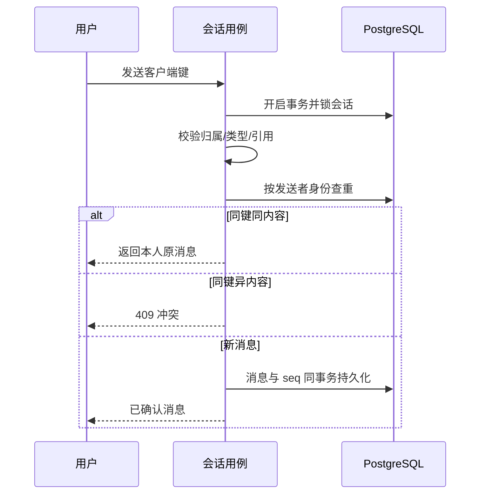

# 2026-10-02 独立审查整改设计与实施计划

负责 Agent：Codex。主领域：CustomerService、AfterSales；协作：IdentityAccess、Payments、Fulfillment、Catalog、Ordering。依据：独立验收 R01–R09。当前状态：本轮整改本地验收通过，见 remediation-verification.md。D015/D019/D020均已由用户明确确认；以下保留当时先设计的过程，未决表述按D020与最新确认更新。此文件记录本次整改，不能作为此前开发遵守流程的证据。

## DDD 与事务边界

复用 Conversation、Message、Ticket、Refund、FulfillmentOrder；不创建统一交易状态。消息幂等值由会话、发送者类别、发送者身份和客户端键共同组成，同键不同内容冲突；内部备注只有客服能发送和读取。历史客服消息无法可靠恢复原作者，保留空作者，不伪造身份。会话关闭后原负责客服仍可读，不能继续发送。

用户会话创建通过事务内按用户串行化查找和插入；数据库部分唯一索引仍是兜底。增量查询在数据库先做可见性筛选，再分页；返回 nextSeq 作为已返回页游标，lastSeq 仅为会话水位。读确认与会话水位分离。

工单关联订单、拼单、会话必须属于本人。转工单需要实际接待客服权限。工单受理后可反复回复；请求反馈、已解决、关闭分别建模，不满意反馈回到处理中。工单 actions 只追加，记录对用户可见的答复，内部记录过滤。

状态补充：处理中请求反馈进入 waiting_feedback，用户反馈满意进入 resolved，不满意回 processing；resolved 后的满意确认保持 resolved 并记 action，非满意重新处理；管理员可 resolved→closed。关闭是唯一不可回退终态。用户提交工单使用 clientTicketId（用户范围唯一，同键同内容恢复、异内容 409），重复受理由 action 客服身份保证，不能抢占别人已受理工单。

退款通过支付公开应用端口，传递同一个 PostgreSQL 事务；关联订单归属、已支付事实、累计退款和工单关联都在执行时复核。申请、批准、渠道到账分别记录。批准角色已由用户D020确认为超级管理员；不得将售后退款伪装成拼单失败。补发同样调用履约公开端口并记录结果。

客服在线事实写入 presence，60 秒过期；候选人须启用、具备客服权限且在线；接待量从真实 active 会话计算。自动分配选择接待量最少者，分配竞争采用事务内串行化。普通客服与主管职责分开，资金操作另行授权。

图片是私有会话附件，上传校验文件大小与真实类型，下载检查会话归属；卡片发送和读取共同调用授权投影端口，不仅检查引用格式。前端重试复用同一消息键。

## Spec 补充

- RC01 用户撞用客服备注客户端键不得得到任何内部内容；用户发送 note/internal 拒绝。
- RC02 同发送者同键重试只写一条，同键不同内容 409；客服转接后作者身份不混用。
- RC03 50 条内部备注之后的公开消息可从 afterSeq=0 得到；nextSeq 不跳过未返回的可见消息；结束会话历史可读。
- RC04 同用户并发建会话都成功且得到同一 ID。
- RC05 工单关联他人资源返回 404；转工单非接待人返回 404。
- RC06 受理后多次回复成功，不满意反馈重新处理，已解决可以关闭；用户详情包含答复。
- RC07 工单退款写 action/审计失败时退款一并回滚，退款关联不一致不得执行。
- RC08 心跳实际落库；自动分配/转接只选在线且具备客服权限的启用账号。
- RC09 商品卡片使用真实商品状态字段，发送卡片和私有图片也执行归属检查。
- RC10 后台具备会话回复、备注、转接、结束、转工单及工单处理页面；小程序具备图片、业务卡片、历史、工单提交/详情/反馈；状态和错误真实展示。

## Plan（晚于上述 DDD/spec）

1. 建立 F031–F035 整改文档，补全领域认领和本次验证边界。
2. 安全、幂等、游标、状态迁移、资源授权和数量规则采用 TDD：先写真实行为回归，记录预期失败，再实现；不得用环境故障充当红灯。
3. F031 修改 conversation-usecases/domain/postgres 与迁移；F032 修改 agent-usecases/presence/角色；F033 通过公开投影端口校验卡片和附件；F034 修改 ticket 用例/仓储/支付履约公开协调；F035 两端 feature 页面和 API 请求模块。
4. 数据迁移追加新编号，不重写已应用迁移；兼容历史无法恢复作者的消息，保持历史订单/数量快照。
5. 前端布局不采用 TDD，接口错误、权限、重复发送和轮询状态用针对性自动测试与浏览器操作验证。
6. 每个子功能先相关测试；全部完成后执行 `npm run test:task:t007`、`npm run test:task:t008` 专项，均通过后 `npm test` 全量及 `npm run smoke:docker`。真实微信、真机缺失如实记录。
7. D020审批及D015改址已明确确认并按批准规则验证；禁止零分配已经由用户 2026-10-02 明确选择，见 T007 修订记录。完整验收后只提交本次相关文件，不推送，不纳入其他 Agent 协作文件或 T005。

## 已确认决策及收尾

D019禁止零分配、异常审核退款；D020客服申请/超级管理员审核执行，新增F036；D015管理员无包裹可版本化改址并审计。先前未决记录已关闭。本地专项/全量/隔离Docker/后台交互通过，见 [最终验证](remediation-verification.md)。
