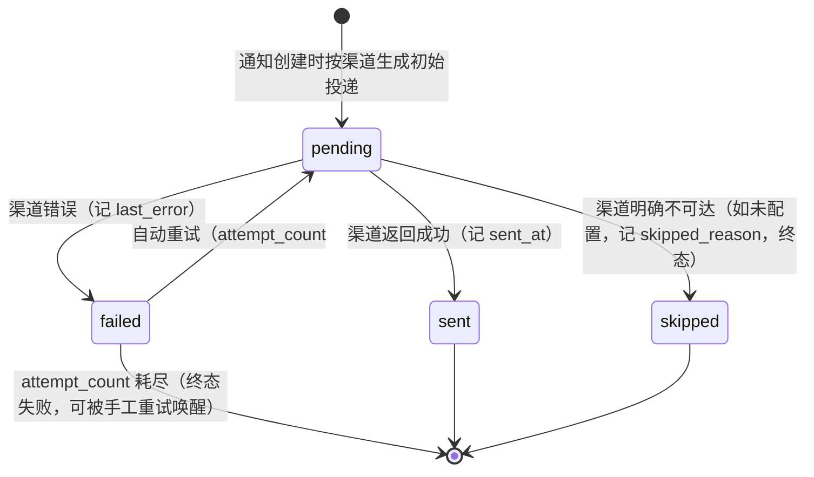
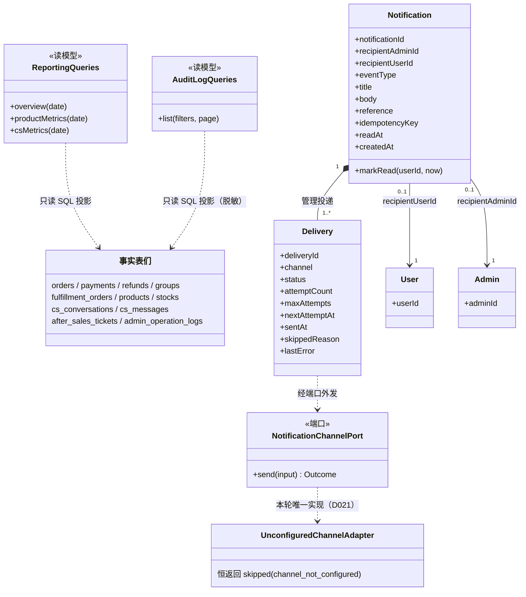
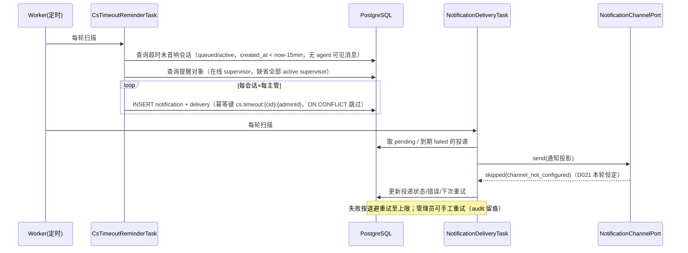

# T009 DDD 领域分析

## 1. 领域认领

| 上下文 | 本轮角色 | 说明 |
| --- | --- | --- |
| Reporting | **本任务新建模型**（此前为空壳） | 运营看板读模型：只读查询投影，不拥有任何交易状态的修改权 |
| Notifications | **本任务新建模型**（此前为空壳） | 通知记录聚合、投递实体、投递驱动与客服超时提醒任务 |
| Audit | **扩展**（已有写入路径，本轮只补查询） | 操作日志只读查询投影；不新增写入语义，写入仍由既有用例与 `TransactionalFulfillmentAudit` 承担 |
| IdentityAccess | 协作（权限码） | 扩展 `ROLE_PERMISSIONS` 与 `AdminPermission`（D025）；不改动认证/会话逻辑 |
| Ordering / GroupBuying / Payments / Fulfillment / CustomerService / AfterSales | 协作（只读事实） | 看板与事件补抓仅读取其持久化事实表；**不修改任何用例代码、不改动已验收行为**（D026） |

统一语言（新增）：**运营看板**（管理端指标汇总页）、**指标口径**（每个指标的时间范围/时区/金额单位的精确定义）、**通知记录**（Notification，发给一个接收者的一条通知）、**投递**（Delivery，一条通知在一个渠道上的投递尝试与状态）、**投递渠道**（NotificationChannel，外发能力端口）、**幂等键**（通知事件去重键）、**已读**（用户在消息中心读过的时间）、**操作日志查询投影**。

## 2. 聚合与实体归属

### 2.1 Notifications 上下文（核心新增）

- **聚合根：Notification（通知记录）**
  - 状态：`notificationId`、`recipientAdminId | recipientUserId`（二选一，恰一非空）、`eventType`（如 `cs.conversation.timeout` / `group.succeeded` / `refund.succeeded`）、`title`（≤120）、`body`（≤500）、`reference`（jsonb：业务引用，如 `{conversationId}`、`{orderId}`）、`idempotencyKey`（≤128，全局唯一）、`readAt`（用户已读时刻，可空）、`createdAt`。
  - **实体：Delivery（投递）**，聚合内集合，生命周期随通知：`deliveryId`、`channel`（`in_app` 预留 / `wechat_subscribe_message`）、`status`、`attemptCount`、`maxAttempts`（默认 5）、`lastError`、`nextAttemptAt`、`sentAt`、`skippedReason`、`updatedAt`；`(notificationId, channel)` 唯一。
- **值对象**：`DeliveryStatus`（状态机，见 §4）、`NotificationEvent`（eventType + 引用类型约束）。
- **领域服务**：无（规则都在聚合内）。

### 2.2 Reporting 上下文（读模型，无聚合）

- 看板指标是**查询投影**，不是聚合：对 orders / payments / refunds / groups / fulfillment_orders / cs_conversations / cs_messages / after_sales_tickets / products / stocks / cs_agent_presence 等事实表做只读 SQL 聚合。
- 边界约束：Reporting 适配器**直接以 SQL 读各上下文持久化事实**（六边形允许的出站只读投影，等同于"报表读模型"约定，AGENTS.md §4「财务和报表使用支付、退款及履约事实形成读模型」）；不 import 任何他域代码，不写任何业务表。

### 2.3 Audit 上下文（查询扩展）

- `OperationLog` 已有领域对象与只写仓储；本轮新增**只读查询投影**（分页/筛选/脱敏），不新增聚合。`admin_operation_logs` 仍不可变（无 UPDATE/DELETE 路径）。

## 3. 跨领域关系与事件接入（D026）

- 事件接入采用 **Worker 扫描式补抓**（复用 D012 履约生成任务的"幂等重扫"模式），不改 T006/T008 用例：
  - `refund.succeeded`：扫描 `refunds.status='succeeded'` 且不存在幂等键 `refund.succeeded:{refundId}` 的通知 → 为订单用户建通知。
  - `group.succeeded`：扫描 `groups.status='success'` 中 paid 订单缺 `group.succeeded:{orderId}` 通知的 → 为每个 paid 订单用户建通知。
  - `cs.conversation.timeout`（D022）：扫描 `cs_conversations.status IN ('queued','active')`、`created_at < now()-阈值`、无客服可见回复（`cs_messages.sender='agent' AND internal=false` 不存在）、且未提醒过该主管的会话。
- 一致性：最终一致，延迟 ≈ 扫描间隔（与既有 Worker 任务同级，秒级）；并发重复由 `idempotency_key` 唯一约束兜底（`ON CONFLICT DO NOTHING` 语义，命中即放弃）。
- 失败补偿：通知行 + 初始投递行同事务写入；写入失败本轮扫描放弃、下轮重扫（业务事实不受影响）；投递失败走投递状态机重试。

## 4. 不变量与状态机

通知聚合不变量：
- **I1 幂等**：`idempotencyKey` 全局唯一；同键重复创建返回已存在通知，不产生新投递。
- **I2 接收者恰一**：`recipientAdminId` 与 `recipientUserId` 恰有一个非空；用户通知才可标记已读。
- **I3 已读权限**：只有接收者本人可把 `readAt` 置为非空；已读后重复标记幂等（保持首次时间）。

投递状态机（I4）：

- **I5 重试上限**：`attemptCount >= maxAttempts` 后不再自动重试；手工重试重置为 `pending` 且 `attemptCount` 归零并审计留痕。
- **I6 skipped 不重试**：`skipped` 是终态（渠道未配置时重试无意义）；手工重试仅对 `failed` 有效，否则 409。
- 统计读模型不变量（I7）：指标只读；同一请求内所有指标基于同一时点快照（单事务/单连接执行）。
- 审计查询不变量（I8）：查询不改任何日志；`detail` 中的手机号在响应层脱敏，不落库变更。

## 5. UML

### 5.1 类图

### 5.2 时序图：客服超时提醒（D022）与投递驱动

### 5.3 竞争条件与失败路径

- 同一会话同时被客服首响与超时扫描命中：超时判断与"是否存在 agent 可见消息"在同一条 SQL 中判定，先提交者胜；已首响的会话不再进入结果集（不会误提醒）。
- 两个 Worker 实例并发扫描：`idempotency_key` 唯一约束 + `ON CONFLICT DO NOTHING`，至多一条通知。
- 投递并发驱动：状态更新使用条件更新（`WHERE status='pending'` / `WHERE status='failed' AND next_attempt_at<=now()`），失败者不重复发送。
- 统计与写入并发：读模型单连接多语句，无跨语句事务假设；指标间微小偏移可接受（看板非账务），spec 注明。

## 6. 事务边界

- 通知 + 初始投递：单事务插入（同会话内两条 INSERT），幂等键冲突整体放弃。
- 投递状态更新：单行条件更新，无跨聚合事务。
- 看板/审计查询：只读，单连接顺序执行；不强求跨指标快照隔离（可接受偏差，见 5.3）。
