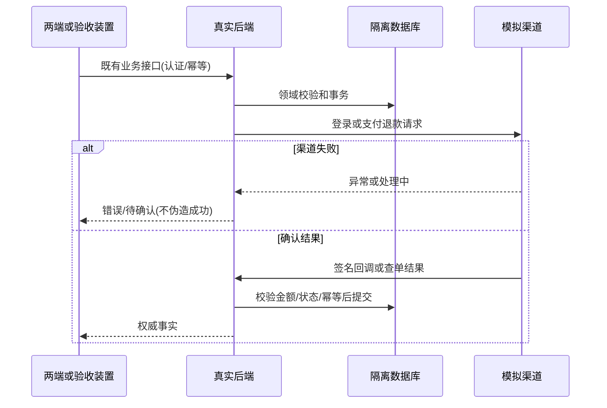

# 本地微信模拟联调领域设计

认领 IdentityAccess / Payments；复用既有聚合，不新增交易领域模型。统一语言：模拟渠道=本地外部能力替身；支付事实=后端验签/查单确认；部署包=配置与版本记录；验收=实际执行证据。

## F041-environment-isolation 环境配置与隔离

增加 APP_ENV=local|simulation|production（默认 local）；微信端点覆盖仅本地/模拟可用，生产必须拒绝。API/Worker 同步收到渠道变量，密钥只读挂载。独立 Compose 项目、卷、数据库、媒体目录；模拟控制面只绑定本机。

## F042-wechat-identity-simulator 登录与手机号模拟

复用 /sns/jscode2session、/cgi-bin/stable_token、/wxa/business/getuserphonenumber 的既有装置契约；固定 alice/bob/charlie 测试身份，模拟凭证与真实凭证隔离。既有 /api/mini/v1/auth/login 和 /auth/phone 不变。拒绝/失效/故障不得创建或修改身份事实。

## F043-wechat-payment-simulator 支付退款模拟

复用 v3 下单/查单/关单/退款契约；金额分、商户订单号与退款号保留。控制面设置渠道状态后发送 RSA 签名、AES-GCM 加密回调；可重放与故障注入。不得直接写业务数据库；站内通知保留 D021。

不变量：金额整数分、份额60单位、实际后端为事实来源；测试数据不混入主库；模拟服务不能在生产装配；无真实渠道验证不得声称到账/触达。事务由既有应用用例和仓储控制；跨域通过公开 HTTP 与既有契约，不新增跨域仓储捷径。

状态：已规划→实现中→验证中→已完成（本地范围）。外部未验单列，不混写。

