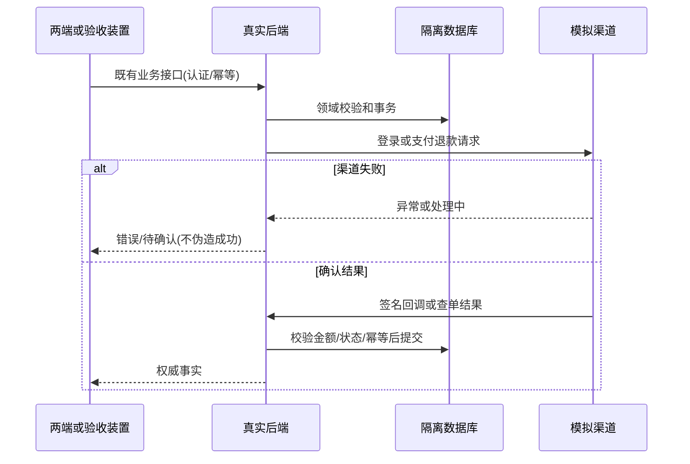

# 两端交互与完整业务验收领域设计

认领 两端 / 跨上下文流程；复用既有聚合，不新增交易领域模型。统一语言：模拟渠道=本地外部能力替身；支付事实=后端验签/查单确认；部署包=配置与版本记录；验收=实际执行证据。

## F044-mini-page-harness 小程序页面交互测试

Node 装置编译并加载实际 TS 页面，以 Page/setData/wx 适配驱动生命周期与点击；HTTP 请求真实本地后端。wx 登录/支付来自模拟渠道；wx 成功回调不能直接判订单已支付。验证权限、加载、空态、失败、取消、刷新和消息已读。

## F045-business-e2e 跨模块完整业务验收

独立库、测试用户和管理员经 HTTP 跑商品→拼单→支付→履约→客服工单→审核退款/补发→通知看板审计。启动真实 Worker，验证中断后补偿恢复，避免在测试直接调用任务代替进程。复用 D015/D019/D020；使用 HTTP 操作形成业务事实，故障/时间探针仅限隔离测试库。

不变量：金额整数分、份额60单位、实际后端为事实来源；测试数据不混入主库；模拟服务不能在生产装配；无真实渠道验证不得声称到账/触达。事务由既有应用用例和仓储控制；跨域通过公开 HTTP 与既有契约，不新增跨域仓储捷径。

状态：已规划→实现中→验证中→已完成（本地范围）。外部未验单列，不混写。

