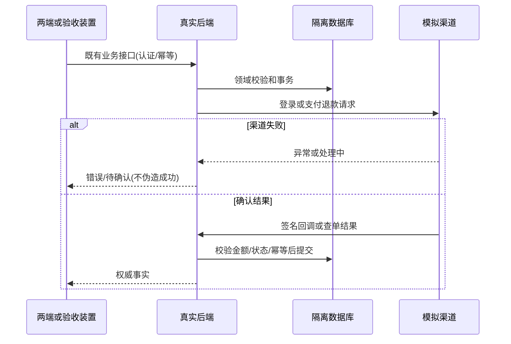

# 部署与运行维护准备领域设计

认领 Bootstrap / 运维；复用既有聚合，不新增交易领域模型。统一语言：模拟渠道=本地外部能力替身；支付事实=后端验签/查单确认；部署包=配置与版本记录；验收=实际执行证据。

## F046-production-deployment 生产部署配置

增加生产 Compose、HTTPS 代理模板、只读密钥与运行配置预检。API/Worker 不开放公网端口，数据库仅内网，admin 经 HTTPS；缺少凭据或模拟端点时生产预检失败。保留本地默认启动。

## F047-backup-health 备份恢复与健康检查

备份 PG 与媒体生成清单及校验摘要，恢复仅指定隔离目标，禁止覆盖当前源项目；备份前暂停 API/Worker 写入，结束恢复原运行状态。核对业务数据与媒体哈希；检查 API/Worker/PG。不记录密钥或连接密码。

## F048-release-rollback 发布演练与交接

提供版本化部署包、迁移/发布/回退说明。回退需明确 schema 兼容；不兼容时从备份恢复到独立项目再切换，不原地盲目降级。本地实际部署/重启/恢复演练；提供真实微信、真机、体验版待验清单。

不变量：金额整数分、份额60单位、实际后端为事实来源；测试数据不混入主库；模拟服务不能在生产装配；无真实渠道验证不得声称到账/触达。事务由既有应用用例和仓储控制；跨域通过公开 HTTP 与既有契约，不新增跨域仓储捷径。

状态：已规划→实现中→验证中→已完成（本地范围）。外部未验单列，不混写。

