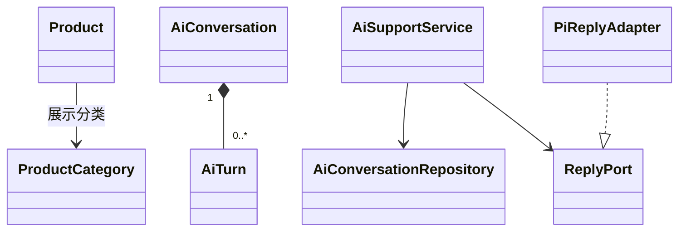
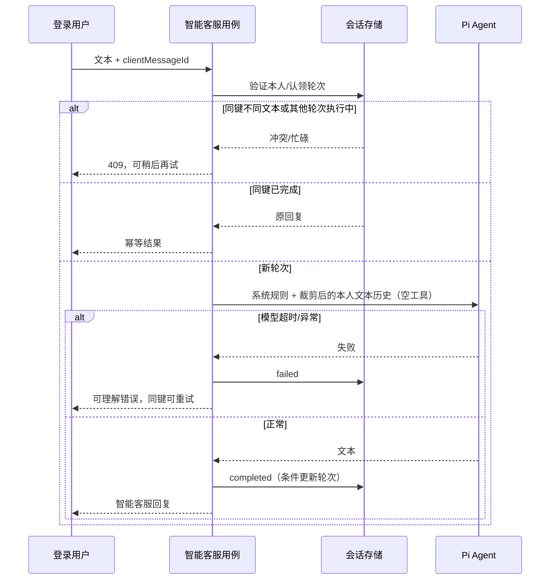

# T013 领域设计

Catalog 继续拥有 Product、媒体关联和发布资格；新增可选展示分类，旧商品默认 other，不进入交易快照，不改变价格或拼单匹配。搜索是公开上架商品读模型，名称关键字与分类同时过滤，先过滤再分页。

IdentityAccess 继续拥有地址簿；微信选点只填表，不保存经纬度、不直接修改历史订单地址。省市区由用户确认，保存仍走现有地址用例。

CustomerService 新增独立智能会话（按 userId 隔离）和轮次实体。仅文字问答；持久化轮次、幂等 clientMessageId 和 pending/completed/failed 状态。应用层授权、限流、上下文裁剪；模型能力为出站端口，Pi Agent 只在适配器内实例化，tools 永远为空。无其他上下文写端口，无文件或命令工具，无全局 Agent。

资金、数量、库存、人工客服、售后审核与通知不变量全部复用原领域。UI 不获得业务权威。

每个数据库认领与完成操作独立短事务；不跨模型 HTTP 调用持有数据库事务。数据库唯一键与租约处理进程重启，旧执行不能覆盖新租约结果。分页查询不加载完整历史。
