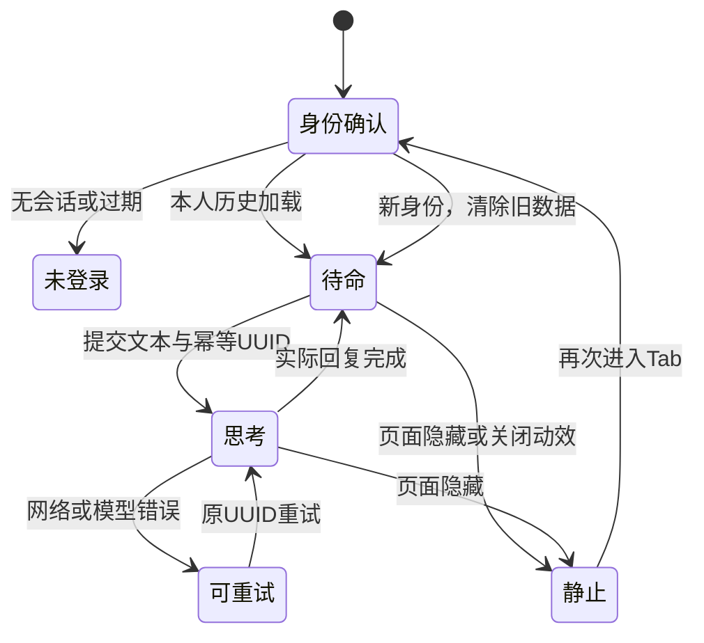
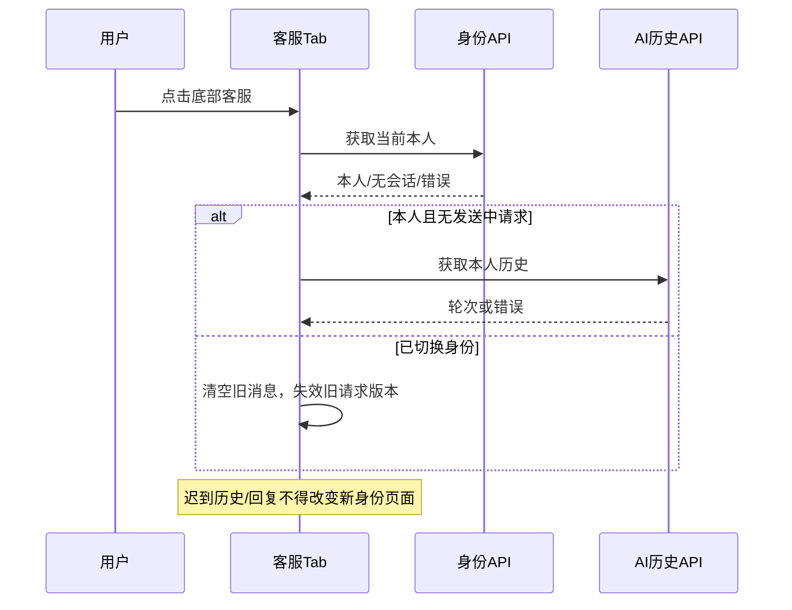

# T014 领域及UML

复用T013与F051的会话/轮次及既有订单、地址；无新增业务聚合、持久化或权限。小精灵是页面状态的投影，不是具有业务执行权的Agent。按钮外观不改变取消、删除的确认及服务端校验。

统一语言：客服Tab=本人AI聊天；人工与售后=既有客服中心；精灵状态=待命/思考/静止。聊天消息仍由本人服务端历史与当前幂等请求组成。金额整数分、单位60、权限/幂等和数据库事务全部复用，不增加微信或模型调用能力。

Tab页面缓存后onShow必须重新确认身份；不同用户或退出登录清空原消息和草稿。异步载入和发送结果只可更新其所属身份及当前请求，旧请求不能覆盖新用户；切走页面停止动效，后台请求可在同身份完成，不阻止原有幂等。

