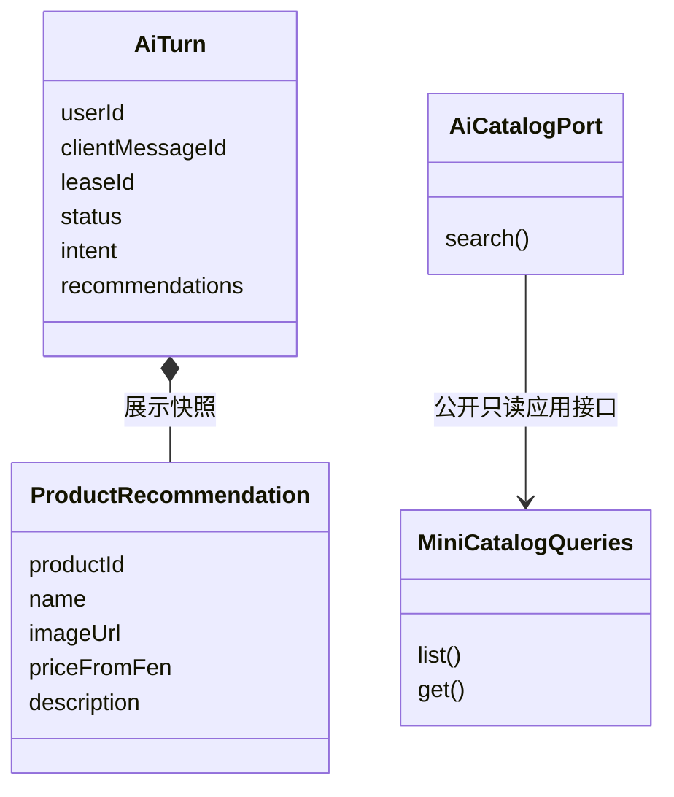
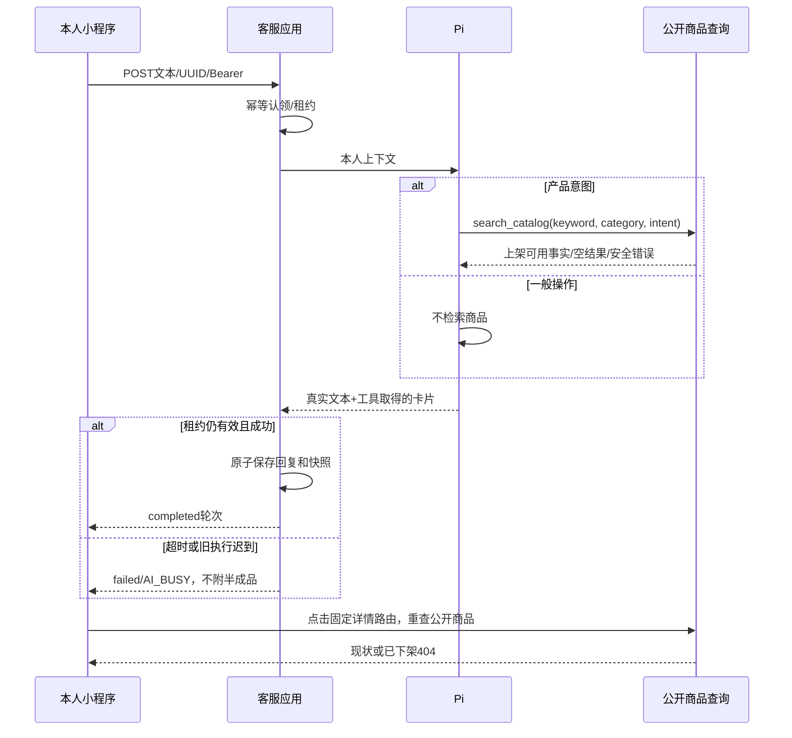

# T015 领域与UML

用户2026-10-06明确授权客服识别产品推荐/介绍意图；这扩展F051此前空tools边界为仅公开商品只读检索，未授权订单/支付/退款/库存/地址修改。商品介绍指客户询问/描述产品需求，不将客户陈述当后台商品事实。

统一语言：导购意图general/product_recommendation/product_introduction；推荐快照为已展示商品的公开事实，不是库存预占或报价。AiTurn仍为本人轮次实体，增加intent与recommendations。不新建交易聚合，商品及库存所有权不变。

Pi通过受限search_catalog工具决定意图并提取keyword/category；CustomerService自有AiCatalogPort由工作流适配MiniCatalogQueries公开应用查询，禁止直读他域仓储。上架+可用库存候选才返回，检索2页×20条、详情最多3条；详情重读时下架/售罄则剔除。卡片ID、名称、图片和分参考价仅来自公开查询，不接收模型生成URL。描述是数据，不是指令。宽查询只返回本次范围结果，不承诺覆盖全库。

分类查询规范化：只将精确的水果/水果商品、零食/零食商品、饮品/饮料/饮品商品、其他/其他商品及对应分类英文值视为分类词；未指定分类时推导该分类，或指定同分类时清空名称关键词。若显式分类冲突则保留原筛选，不放宽；具体名称及未知词不做失败后的宽搜索。这是只读查询参数规范化，不另建文本意图分类器。

模型每条最多3次请求、检索工具最多2次，沿用30秒超时/45秒租约/每分钟10次/历史本人20轮8000字符。不可识别工具、无匹配、查询失败均无写副作用；模型失败不发布半成品卡片。跟进问题可读取本人已展示商品名称快照作为上下文。

事务：查询/模型在AiTurn认领后的事务外；reply+intent+recommendations在同一leaseId条件UPDATE中完成；失败及重试清空元数据。重放与历史读持久快照，不重新检索，更不改变历史价格。点击详情重查实时公开商品，过期快照允许显示但不承诺仍有货。

